# Лабораторная работа №10

# Задание 1

**Шаги:**
1. Создать функцию расчета средней стоимости билета по классу обслуживания;
2. Продемонстрировать работу функции.

**Функция:**
```postgresql
create or replace function get_average_class_amount()
returns table (
    fare_conditions varchar(10),
    average_amount numeric(10, 2)
)
as $$
begin
    return query
    select tf.fare_conditions as "Класс", avg(amount) as "Средняя цена билета"
    from tickets t
    join ticket_flights tf
        on t.ticket_no = tf.ticket_no
    group by tf.fare_conditions
    order by tf.fare_conditions;
end;
$$ language plpgsql;
```
**Вызов:**
```postgresql
select * from get_average_class_amount();
```

**Результат:**

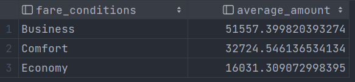


# Задание 2

**Шаги:**
1. Создать функцию подсчета количества рейсов по аэропорту отправления;
2. Продемонстрировать работу функции.

**Функция:**
```postgresql
create or replace function get_departures_by_airports()
returns table (
    airport_name text,
    departure_count bigint
)
as $$
begin
    return query
    select a.airport_name as "Аэропорт", count(*) as "Количество вылетов"
    from airports a
    join flights f
        on a.airport_code = f.departure_airport
    group by a.airport_name
    order by a.airport_name;
end;
$$ language plpgsql;
```
**Вызов:**
```postgresql
select * from get_departures_by_airports();
```

**Результат:**

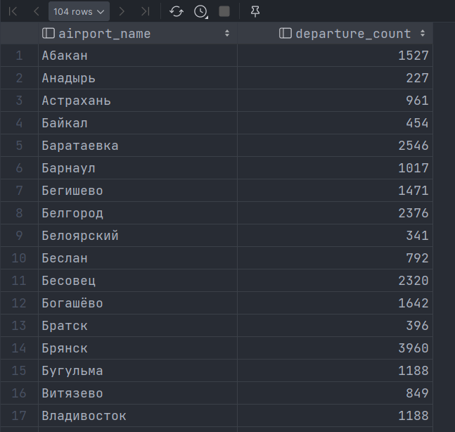


# Задание 3

**Шаги:**
1. Создать функцию получения информации о пассажире по номеру билета;
2. Продемонстрировать работу функции.

**Функция:**
```postgresql
create or replace function get_passenger_info_by_ticket_number(
    ticket_number char(13)
)
returns table (
    passenger_id varchar(20),
    passenger_name text,
    contact_data jsonb
)
as $$
begin
    return query
    select 
        t.passenger_id as "Идентификатор пассажира",
        t.passenger_name as "Имя пассажира",
        t.contact_data as "Контактная инфомация"
    from tickets t
    where t.ticket_no = ticket_number;
end;
$$ language plpgsql;
```
**Вызов:**
```postgresql
select * from get_passenger_info_by_ticket_number('0005432000284');
```

**Результат:**


# Задание 4

**Шаги:**
1. Создать функцию расчета общей выручки по рейсу;
2. Продемонстрировать работу функции.

**Функция:**
```postgresql
create or replace function get_flights_sales()
returns table (
    flight_id integer,
    sales numeric
)
as $$
begin
    return query
    select 
        f.flight_id as "Идентификатор рейса",
        sum(tf.amount) as "Выручка"
    from flights f 
    join ticket_flights tf
        on f.flight_id = tf.flight_id
    group by f.flight_id;
end;
$$ language plpgsql;
```
**Вызов:**
```postgresql
select * from get_flights_sales();
```

**Результат:**

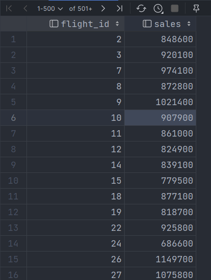


# Задание 5

**Шаги:**
1. Создать функцию проверки доступности места в самолете;
2. Продемонстрировать работу функции.

**Функция:**
```postgresql
create or replace function is_place_available(
    flight_id integer,
    seat_number char(4)
)
returns boolean
as $$
begin
    return (
        select count(*) = 0 as "Доступно"
        from ticket_flights tf
        left join boarding_passes bp
            on tf.ticket_no = bp.ticket_no
        where bp.flight_id = is_place_available.flight_id
            and bp.seat_no = is_place_available.seat_number
    );
end;
$$ language plpgsql;
```
**Вызов:**
```postgresql
select * from is_place_available(117052, '1C');
```

**Результат:**


# Задание 6

**Шаги:**
1. Создать функцию расчета продолжительности полета в часах;
2. Продемонстрировать работу функции.

**Функция:**
```postgresql
create or replace function get_flight_time(
    flight_id integer
)
returns time
as $$
begin
    return (
        select scheduled_arrival - scheduled_departure
        from flights f
        where f.flight_id = get_flight_time.flight_id
    );
end;
$$ language plpgsql;
```
**Вызов:**
```postgresql
select * from get_flight_time(117052);
```

**Результат:**


# Задание 7

**Шаги:**
1. Создать функцию поиска рейсов по городу отправления и прибытия;
2. Продемонстрировать работу функции.

**Функция:**
```postgresql
create or replace function get_flights_by_departure_and_arrival_airports (
    departure_city text,
    arrival_city text
)
returns table (
    flight_id integer,
    departure text,
    arrival text
)
as $$
begin
    return query 
    select 
        f.flight_id as "Идентификатор рейса",
        da.city as "Город отправления",
        aa.city as "Город прибытия"
    from flights f
    join airports da
        on f.departure_airport = da.airport_code
    join airports aa 
        on f.arrival_airport = aa.airport_code
    where da.city = get_flights_by_departure_and_arrival_airports.departure_city
    and aa.city = get_flights_by_departure_and_arrival_airports.arrival_city;
end;
$$ language plpgsql;
```
**Вызов:**
```postgresql
select * from get_flights_by_departure_and_arrival_airports('Москва', 'Самара');
```

**Результат:**

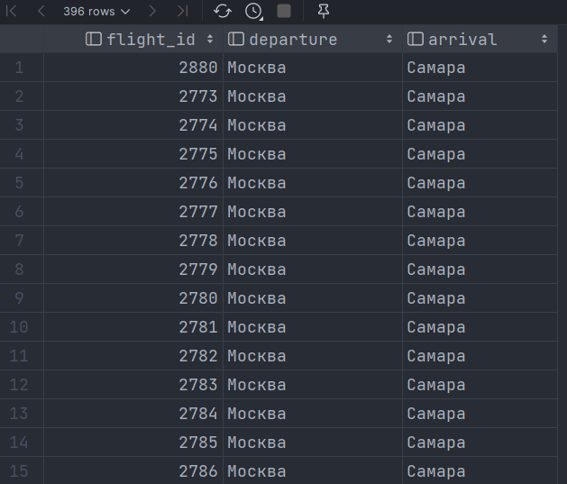


# Задание 8

**Шаги:**
1. Создать функцию подсчета пассажиров по рейсу;
2. Продемонстрировать работу функции.

**Функция:**
```postgresql
create or replace function get_passenger_count_by_flight (
    flight_id integer
)
returns bigint
as $$
begin
    return (
        select count(*) as пассажиры
        from ticket_flights tf 
        where tf.flight_id = get_passenger_count_by_flight.flight_id
        group by tf.flight_id
    );
end;
$$ language plpgsql;
```
**Вызов:**
```postgresql
select * from get_passenger_count_by_flight(117052);
```

**Результат:**


# Задание 9

**Шаги:**
1. Создать функцию обновления статуса рейса;
2. Продемонстрировать работу функции.

**Функция:**
```postgresql
create or replace function update_flight_status (
    flight_id integer,
    flight_status varchar(20)
)
returns table (
    id integer,
    status varchar(20)
)
as $$
begin
    return query 
    update flights as f
    set status = update_flight_status.flight_status
    where f.flight_id = update_flight_status.flight_id
    returning 
        f.flight_id as "Идентификатор рейса",
        f.status as "Статус рейса";
end;
$$ language plpgsql;
```
**Вызов:**
```postgresql
select * from update_flight_status(117052, 'Arrived');
```

**Результат:**


# Задание 10

**Шаги:**
1. Создать функцию расчета загрузки самолета по рейсу;
2. Продемонстрировать работу функции.

**Функция:**
```postgresql
create or replace function get_aircraft_load (
    flight_id integer
)
returns numeric
as $$
begin
    return (
        select 
        (
           select count(*)
           from ticket_flights tf
           where tf.flight_id = get_aircraft_load.flight_id
           group by tf.flight_id
        ) /
        (
           select count(*) 
           from flights f 
           join aircrafts a 
               on f.aircraft_code = a.aircraft_code
           join seats s 
               on a.aircraft_code = s.aircraft_code
           where f.flight_id = get_aircraft_load.flight_id
        )::numeric
    );
end;
$$ language plpgsql;
```
**Вызов:**
```postgresql
select * from get_aircraft_load(117052);
```

**Результат:**

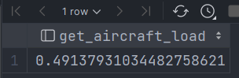


# Задание 11

**Шаги:**
1. Создать функцию поиска самых популярных маршрутов;
2. Продемонстрировать работу функции.

**Функция:**
```postgresql
create or replace function get_top_routes (
    top integer
)
returns table (
    departure_airport_code char(3),
    arrival_airport_code char(3),
    times bigint
)
as $$
begin
    return query
    select 
        f.departure_airport,
        f.arrival_airport,
        count(*) as times
    from flights f
    group by 
        departure_airport,
        arrival_airport
    order by times
    limit get_top_routes.top;
    
end;
$$ language plpgsql;
```
**Вызов:**
```postgresql
select * from get_top_routes(5)
```

**Результат:**

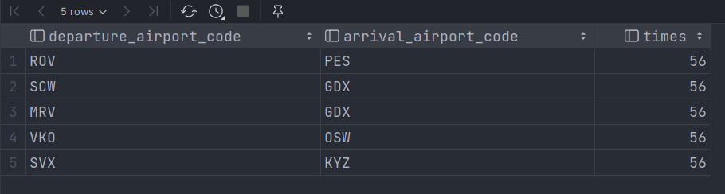


# Задание 12

**Шаги:**
1. Создать функцию расчета доходов по периоду;
2. Продемонстрировать работу функции.

**Функция:**
```postgresql
create or replace function get_sales_in_period (
    since timestamp,
    till timestamp
)
returns bigint
as $$
begin
    return (
        select sum(amount)
        from ticket_flights tf
        join flights f
            on tf.flight_id = f.flight_id
        where f.actual_departure > get_sales_in_period.since
        and f.actual_arrival < get_sales_in_period.till
    );
end;
$$ language plpgsql;
```
**Вызов:**
```postgresql
select * from get_sales_in_period('2017-01-01', '2017-02-01')
```

**Результат:**

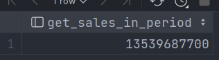


# Задание 13

**Шаги:**
1. Создать функцию получения истории полетов пассажира;
2. Продемонстрировать работу функции.

**Функция:**
```postgresql
create or replace function get_flight_history (
    passenger_id varchar(20)
)
returns table (
    passenger_id_param varchar(20),
    passenger_name_param text,
    fare_conditions_param varchar(10),
    amount_param numeric,
    departure_airport_param char(3),
    arrival_airport_param char(3),
    scheduled_departure_param timestamptz,
    scheduled_arrival_param timestamptz
)
as $$
begin
    return query 
    
    select
        t.passenger_id,
        t.passenger_name,
        tf.fare_conditions,
        tf.amount,
        f.departure_airport,
        f.arrival_airport,
        f.scheduled_departure,
        f.scheduled_arrival
    from tickets t
    join ticket_flights tf 
        on t.ticket_no = tf.ticket_no
    join flights f 
        on tf.flight_id = f.flight_id
    where t.passenger_id = get_flight_history.passenger_id;
    
end;
$$ language plpgsql;
```
**Вызов:**
```postgresql
select * from get_flight_history('2221 748082')
```

**Результат:**

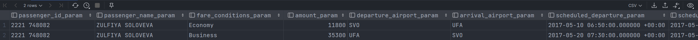


# Задание 14

**Шаги:**
1. Создать функцию проверки возможности бронирования;
2. Продемонстрировать работу функции.

**Функция:**
```postgresql
create or replace function is_booking_available (
    flight_id integer
)
returns boolean
as $$
begin
    return (
        select 
            (
                select count(*)
                from flights f
                join aircrafts a 
                    on f.aircraft_code = a.aircraft_code
                join seats s 
                    on a.aircraft_code = s.aircraft_code
                where f.flight_id = is_booking_available.flight_id
            )
            -
            (
                select count(*)
                from ticket_flights tf
                where tf.flight_id = is_booking_available.flight_id
            ) != 0
    );
    
end;
$$ language plpgsql;
```
**Вызов:**
```postgresql
select * from is_booking_available(2880)
```

**Результат:**

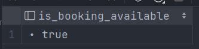


# Задание 15

**Шаги:**
1. Создать функцию генерации номера бронирования;
2. Продемонстрировать работу функции.

**Функция:**
```postgresql
create or replace function gen_booking_id ()
returns char(6)
as $$
begin
    create sequence if not exists bookings_id_seq
        start with 1
        increment by 1;
    return (
        select lpad(
           to_hex(nextval('bookings_id_seq')),
           6,
           '0'
        )
    ); 
end;
$$ language plpgsql;
```
**Вызов:**
```postgresql
select * from gen_booking_id()
```

**Результат:**

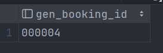


# Задание 17

**Шаги:**
1. Создать функцию поиска задержанных рейсов;
2. Продемонстрировать работу функции.

**Функция:**
```postgresql
create or replace function get_delayed_flights()
returns table (
    flight_id integer
)
as $$
begin
    return query 
    
    select f.flight_id
    from flights f
    where f.scheduled_departure != f.actual_departure;
end;
$$ language plpgsql;
```
**Вызов:**
```postgresql
select * from get_delayed_flights()
```

**Результат:**

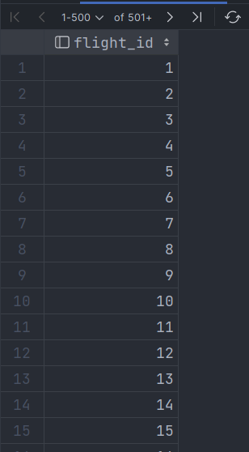


# Задание 18

**Шаги:**
1. Создать функцию расчета частоты полетов по маршруту;
2. Продемонстрировать работу функции.

**Функция:**
```postgresql
create or replace function get_route_frequency(
    departure_airport_name text,
    arrival_airport_name text
)
returns table (
    da_name text,
    aa_name text,
    flights bigint
)
as $$
begin
    return query 
    select 
        da.airport_name,
        aa.airport_name,
        count(*)
    from flights f 
    join airports da 
        on f.departure_airport = da.airport_code
    join airports aa
        on f.arrival_airport = aa.airport_code
    where da.airport_name = get_route_frequency.departure_airport_name
    and aa.airport_name = get_route_frequency.arrival_airport_name
    group by 
        da.airport_name,
        aa.airport_name;
end;
$$ language plpgsql;
```
**Вызов:**
```postgresql
select * from get_route_frequency('Шереметьево', 'Пулково');
```

**Результат:**

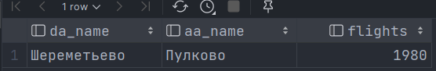


# Задание 19

**Шаги:**
1. Создать функцию создания резервной копии данных рейса;
2. Продемонстрировать работу функции.

**Функция:**
```postgresql
create or replace function backup_flights()
returns void
as $$
begin
    copy flights
    to '/tmp/my_table.csv'
    with (format csv, header true);
end;
$$ language plpgsql;
```
**Вызов:**
```postgresql
select * from backup_flights();
```


# Задание 20

**Шаги:**
1. Создать функцию валидации данных пассажира;
2. Продемонстрировать работу функции.

**Функция:**
```postgresql
create type passenger_validation_result as (
    is_valid boolean,
    errors text[]
);
create or replace function validate_passenger_data(
    full_name text,
    passport_number text,
    birth_date date,
    email text default null,
    phone text default null
)
    returns passenger_validation_result AS $$
declare 
    result passenger_validation_result;
    age_in_years integer;
    errors text[] := '{}';
begin
    result.is_valid := true;
    result.errors := '{}';

    if full_name is null or full_name = '' then
        errors := array_append(errors, 'ФИО не может быть пустым');
        result.is_valid := false;
    else if length(full_name) > 100 then
        errors := array_append(errors, 'ФИО слишком длинное (максимум 100 символов)');
        result.is_valid := false;
    end if;

    if passport_number is null or passport_number = '' then
        errors := array_append(errors, 'Номер паспорта не может быть пустым');
        result.is_valid := false;
    else
        if not passport_number ~ '^[A-Z]{2}[0-9]{7}$' then
            -- Вариант 2: цифровой формат (10 цифр)
            if not passport_number ~ '^[0-9]{10}$' then
                errors := array_append(errors, 'Неверный формат номера паспорта');
                result.is_valid := false;
            end if;
        end if;
    end if;

    -- 3. Проверка возраста (≥ 18 лет)
    age_in_years := extract(year from age(current_date, birth_date));
    if birth_date is null then
        errors := array_append(errors, 'Дата рождения не может быть пустой');
        result.is_valid := false;
    elseif age_in_years < 18 then
        errors := array_append(errors, 'Пассажир должен быть старше 18 лет');
        result.is_valid := false;
    end if;

    -- 4. Проверка email (если указан)
    if email is not null and email != '' then
        if not email ~* '^[A-Za-z0-9._%+-]+@[A-Za-z0-9.-]+\.[A-Za-z]{2,}$' then
            errors := array_append(errors, 'Некорректный email');
            result.is_valid := false;
        end if;
    end if;

    -- 5. Проверка телефона (если указан)
    if phone is not null and phone != '' then
        -- Пример: +79123456789 или 89123456789
        if not phone ~ '^\+?[0-9]{10,15}$' then
            errors := array_append(errors, 'Некорректный номер телефона (ожидается 10–15 цифр, можно с +)');
            result.is_valid := false;
        end if;
    end if;

    -- Заполняем результат
    result.errors := errors;
    return result;
end;
$$ language plpgsql;
```
**Вызов:**
```postgresql
select * from validate_passenger_data(
    'Андрианов Иван Андреевич',
    'AB1234567',
    '2003-07-20',
    'ivanushka2003@gmail.com',
    '+79685719211'
)
```

**Результат:**


# Задание 21

**Шаги:**
1. Создать функцию расчета оптимального тарифа;
2. Продемонстрировать работу функции.

**Функция:**
```postgresql
create or replace function get_optimal_tariff(
    departure_city_name text,
    arrival_city_name text
)
returns table (
    da_name text,
    aa_name text,
    amount numeric
)
as $$
begin
    return query 
    
    select 
        da.city,
        aa.city,
        min(tf.amount) as amount
    from ticket_flights tf
    join flights f 
        on tf.flight_id = f.flight_id
    join airports aa 
        on f.arrival_airport = aa.airport_code
    join airports da
        on f.departure_airport = da.airport_code
    where da.city = get_optimal_tariff.departure_city_name
    and aa.city = get_optimal_tariff.arrival_city_name
    group by da.city, aa.city
    order by amount
    limit 1;
end;
$$ language plpgsql;
```
**Вызов:**
```postgresql
select * from get_optimal_tariff('Москва', 'Хабаровск');
```

**Результат:**

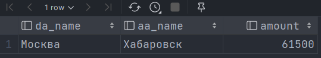


# Задание 22

**Шаги:**
1. Создать функцию мониторинга производительности системы;
2. Продемонстрировать работу функции.

**Функция:**
```postgresql
create or replace function monitor_short()
    returns table(metric text, value text, severity text) as $$
begin
    return query
        select
            'active_connections',
            count(*)::text,
            case when count(*) > 100 then 'critical' else 'ok' end
        from pg_stat_activity where state = 'active';

    return query
        select
            'long_transactions (>30s)',
            count(*)::text,
            case when count(*) > 0 then 'critical' else 'ok' end
        from pg_stat_activity
        where (now() - xact_start) > interval '30 seconds' and state = 'active';
end;
$$ language plpgsql;
```
**Вызов:**
```postgresql
select * from monitor_short()
```

**Результат:**

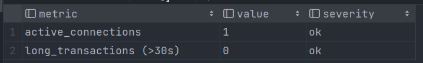


# Задание 23

**Шаги:**
1. Создать функцию поиска альтернативных рейсов;
2. Продемонстрировать работу функции.

**Функция:**
```postgresql
create or replace function get_alternative_flights(
    flight_id integer
)
returns table(
    flight_id_rt integer,
    d_airport_name text,
    a_airport_name text,
    scheduled_departure timestamptz
) as $$
declare 
    d_city_name text := (
        select an.city
        from flights f
        join airports an
            on f.departure_airport = an.airport_code
        where f.flight_id = get_alternative_flights.flight_id
        limit 1
    );
    
    a_city_name text := (
        select an.city
        from airports an
                 join flights f
                      on f.arrival_airport = an.airport_code
        where f.flight_id = get_alternative_flights.flight_id
        limit 1
    );
begin
    raise notice 'd_city_name: %', d_city_name;
    raise notice 'a_city_name: %', a_city_name;
    return query
    
    select 
        f.flight_id,
        da.airport_name,
        aa.airport_name,
        f.scheduled_departure
    from flights f
    join airports da
        on f.departure_airport = da.airport_code
    join airports aa
         on f.arrival_airport = aa.airport_code
    where f.flight_id != get_alternative_flights.flight_id
    and da.city = d_city_name
    and aa.city = a_city_name;
end;
$$ language plpgsql;
```
**Вызов:**
```postgresql
select * from get_alternative_flights(1)
```

**Результат:**

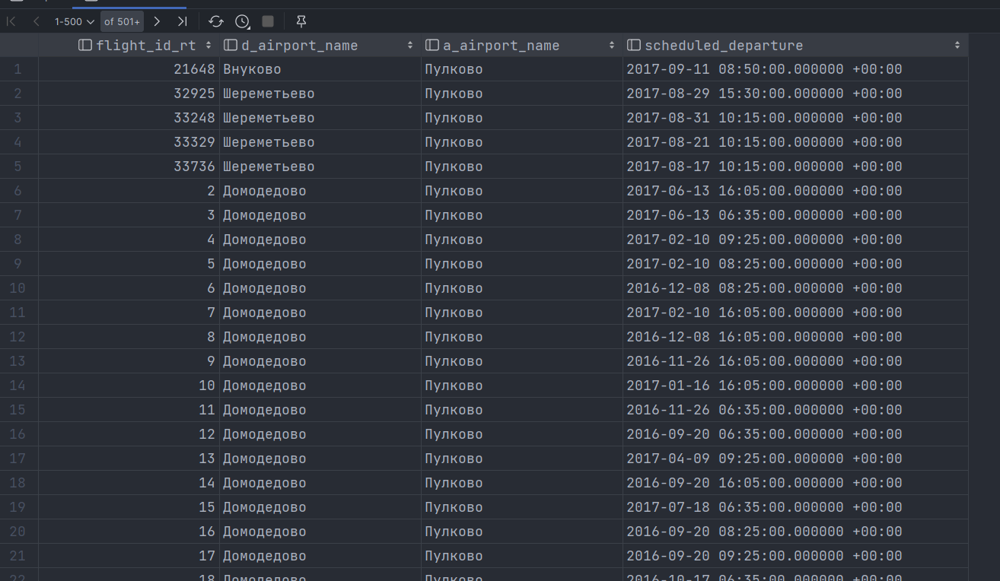


# Задание 24

**Шаги:**
1. Создать функцию расчета бонусной программы;
2. Продемонстрировать работу функции.

**Функция:**
```postgresql
create or replace function get_price_with_bonus(
    flight_id integer,
    passenger_id varchar(20)
)
returns numeric as $$
declare 
    departure_timestamp timestamptz := (
        select scheduled_departure
        from flights f
        where f.flight_id = get_price_with_bonus.flight_id
    );
    flight_times_last_6_months integer := (
        select count(*)
        from flights f
        join ticket_flights tf
            on f.flight_id = tf.flight_id
        join tickets t 
            on tf.ticket_no = t.ticket_no
        where t.passenger_id = get_price_with_bonus.passenger_id
        and f.scheduled_departure > (departure_timestamp - interval '6 months')
    );
begin
    return (
        select (tf.amount * (1 - (flight_times_last_6_months * 0.05)))
        from ticket_flights tf
        join tickets t on tf.ticket_no = t.ticket_no
        where tf.flight_id = get_price_with_bonus.flight_id
        and t.passenger_id = get_price_with_bonus.passenger_id
    );
end;
$$ language plpgsql;
```
**Вызов:**
```postgresql
select * from get_price_with_bonus(214848, '7521 113483')
```

**Результат:**

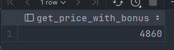


# Задание 25

**Шаги:**
1. Создать функцию прогнозирования загрузки рейсов;
2. Продемонстрировать работу функции.

**Функция:**
```postgresql
create or replace function get_expected_load(
    flight_id integer
)
returns numeric as $$
declare 
    -- Коэффициент вероятности события, при котором пассажир купивший билет примет участие в рейсе
    coefficient numeric := 0.9;
begin
    return (
        select count(*) * coefficient
        from tickets t 
        join ticket_flights tf
            on t.ticket_no = tf.ticket_no
        where tf.flight_id = get_expected_load.flight_id
    );
end;
$$ language plpgsql;
```
**Вызов:**
```postgresql
select * from get_expected_load(2)
```

**Результат:**

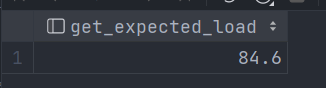


# Задание 26

**Шаги:**
1. Создать функцию аудита изменений в таблице рейсов;
2. Продемонстрировать работу функции.

**Функция:**
```postgresql
create table if not exists flights_audit (
   audit_id bigserial primary key ,
   flight_id integer,
   operation char(1) not null,
   changed_at timestamptz not null default now(),
   changed_by text not null default current_user,
   old_data jsonb,
   new_data jsonb
);
create or replace function audit_flights_changes()
    returns trigger as $$
begin
    raise notice '%', tg_op;
    if tg_op = 'INSERT' then
        insert into flights_audit (flight_id, operation, new_data)
        values (new.flight_id, 'i', to_jsonb(new));
        return new;

    elsif tg_op = 'UPDATE' then
        insert into flights_audit (flight_id, operation, old_data, new_data)
        values (old.flight_id, 'u', to_jsonb(old), to_jsonb(new));
        return new;

    elsif tg_op = 'DELETE' then
        insert into flights_audit (flight_id, operation, old_data)
        values (old.flight_id, 'd', to_jsonb(old));
        return old;

    else
        raise exception 'unexpected tg_op value: %', tg_op;
    end if;

    return null;
end;
$$ language plpgsql;

create trigger trigger_flights_audit
    after insert or update or delete on flights
    for each row
execute function audit_flights_changes();
```

**Вызов:**
```postgresql
update flights set status = 'Delayed'
where flight_id < 4;

select * 
from flights_audit fa 
```

**Результат:**

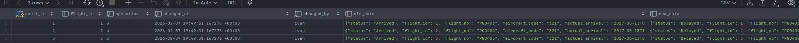


# Задание 27

**Шаги:**
1. Создать функцию комплексного отчета по самолету за период;
2. Продемонстрировать работу функции.

**Функция:**
```postgresql
create or replace function get_aircraft_statistic (
    aircraft_code char(3),
    since timestamptz,
    till timestamptz
)
returns table (
    aircraft_code_out char(3),
    sales numeric,
    passengers_count integer,
    flights_count integer
)
    
as $$
declare 
    sales numeric := (
        select sum(tf.amount) as sales
        from aircrafts a
        join flights f
            on a.aircraft_code = f.aircraft_code
        join ticket_flights tf
            on f.flight_id = tf.flight_id
        where a.aircraft_code = get_aircraft_statistic.aircraft_code
            and f.scheduled_departure > since
            and f.scheduled_arrival < till
        group by a.aircraft_code, a.model
    );
    
    passengers_count integer := (
        select count(*) as passengers_count
        from aircrafts a
        join flights f
             on a.aircraft_code = f.aircraft_code
        join ticket_flights tf
             on f.flight_id = tf.flight_id
        where a.aircraft_code = get_aircraft_statistic.aircraft_code
            and f.scheduled_departure > since
            and f.scheduled_arrival < till
        group by a.aircraft_code, a.model
    );
    
    flights_count integer := (
        select count(*) as flights_count
        from aircrafts a
        join flights f
            on a.aircraft_code = f.aircraft_code
        where f.scheduled_departure > since
            and f.scheduled_arrival < till
    );
begin
    return query 
    select get_aircraft_statistic.aircraft_code, sales, passengers_count, flights_count;
end;
$$ language plpgsql;
```
**Вызов:**
```postgresql
select * from get_aircraft_statistic('773', '2016-01-01', '2018-01-01')
```

**Результат:**

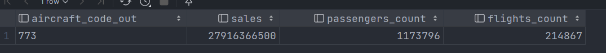