# Лабораторная работа №11

## Задание 1

**Шаги:**
1. Создать триггер, который проверяет, что стоимость билета соответствует классу обслуживания (Economy < Comfort < Business);
2. Использовать when для проверки.

**Скрипт:**
```postgresql
create or replace function check_fare_condition_amount()
returns trigger as $$
begin
    if new.fare_conditions = 'Economy' then
        if new.amount < 5000 then
            raise exception 'стоимость билета economy не может быть меньше 5000 руб.';
        end if;
    elsif new.fare_conditions = 'Comfort' then
        if new.amount < 10000 then
            raise exception 'стоимость билета comfort не может быть меньше 10000 руб.';
        elsif new.amount <= (select min(amount) from ticket_flights where fare_conditions = 'Economy') then
            raise exception 'стоимость билета comfort должна быть выше стоимости economy.';
        end if;
    elsif new.fare_conditions = 'Business' then
        if new.amount < 20000 then
            raise exception 'стоимость билета business не может быть меньше 20000 руб.';
        elsif new.amount <= (select max(amount) from ticket_flights where fare_conditions in ('Economy', 'Comfort')) then
            raise exception 'стоимость билета business должна быть выше стоимости comfort и economy.';
        end if;
    else
        raise exception 'неизвестный класс обслуживания: %', new.fare_conditions;
    end if;
    return new;
end;
$$ language plpgsql;

create trigger trigger_check_fare_amount
before insert or update on ticket_flights
for each row
when (new.fare_conditions in ('Economy', 'Comfort', 'Business'))
execute function check_fare_condition_amount();
```

Результат:

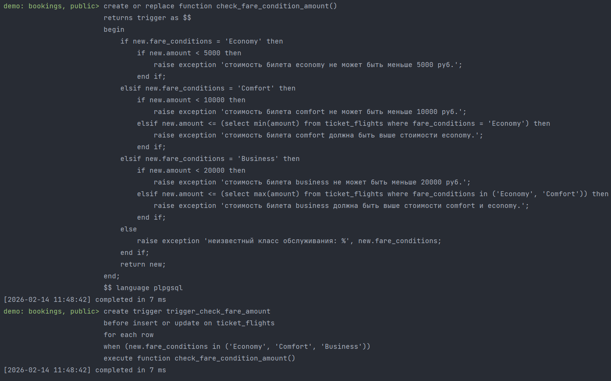


## Задание 2

**Шаги:**
1. Создать триггер, автоматического расчета общей суммы бронирования.

**Скрипт:**
```postgresql
create or replace function update_booking_total_amount()
    returns trigger as $$
begin
    if tg_op = 'insert' then
        update bookings
        set total_amount = total_amount + new.amount
        where book_ref = (
            select book_ref
            from tickets
            where ticket_no = new.ticket_no
        );
    elsif tg_op = 'delete' then
        update bookings
        set total_amount = total_amount - old.amount
        where book_ref = (
            select book_ref
            from tickets
            where ticket_no = old.ticket_no
        );
    end if;
    return null;
end;
$$ language plpgsql;

create trigger trigger_update_booking_total
    after insert or delete on ticket_flights
    for each row
execute function update_booking_total_amount();
```

Результат:


## Задание 3

**Шаги:**
1. Создать триггер, который предотвращает продажу билетов, если все места в определенном классе обслуживания уже заняты.

**Скрипт:**
```postgresql
create or replace function check_seat_availability()
    returns trigger as $$
declare
    available_seats int;
    total_seats int;
begin
    select count(*)
    into total_seats
    from seats
    where aircraft_code = (
        select aircraft_code
        from flights
        where flight_id = new.flight_id
    )
      and fare_conditions = new.fare_conditions;
    select count(*)
    into available_seats
    from ticket_flights tf
             join tickets t on tf.ticket_no = t.ticket_no
             join flights f on tf.flight_id = f.flight_id
    where f.flight_id = new.flight_id
      and tf.fare_conditions = new.fare_conditions;

    if available_seats >= total_seats then
        raise exception 'все места в классе % на рейсе % уже заняты', new.fare_conditions, new.flight_id;
    end if;

    return new;
end;
$$ language plpgsql;

create trigger trigger_check_seat_availability
    before insert on ticket_flights
    for each row
execute function check_seat_availability();
```

Результат:

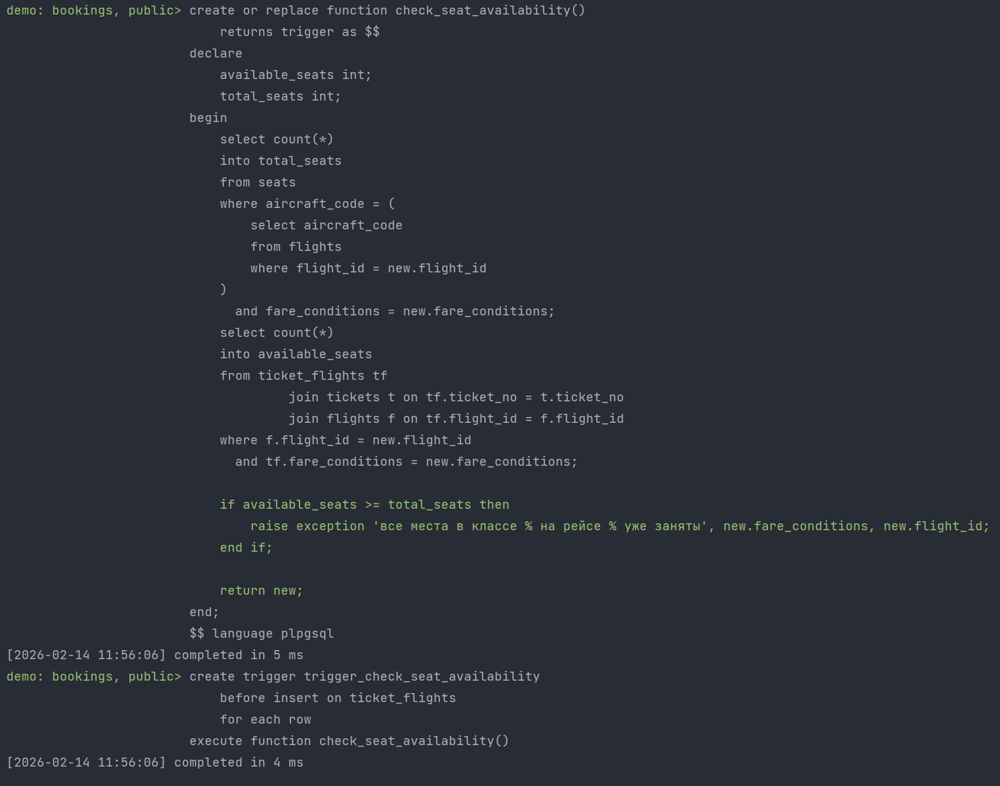


## Задание 4

**Шаги:**
1. Создать триггер, который проверяет, что фактическое время прибытия не может быть раньше времени вылета;
2. Использовать exception для обработки ошибок.

**Скрипт:**
```postgresql
create or replace function validate_flight_times()
    returns trigger as $$
begin
    if new.actual_arrival is not null and new.actual_departure is not null then
        if new.actual_arrival < new.actual_departure then
            raise exception 'фактическое время прибытия не может быть раньше времени вылета';
        end if;
    end if;
    return new;
end;
$$ language plpgsql;

create trigger trigger_validate_flight_times
    before insert or update on flights
    for each row
execute function validate_flight_times();
```

Результат:

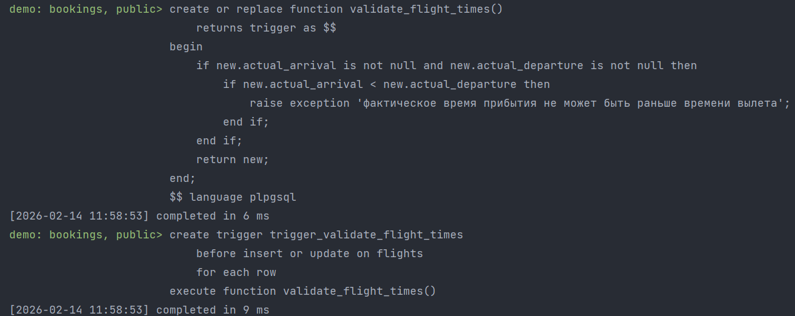


## Задание 5

**Шаги:**
1. Создать триггер, который при установке actual_departure меняет статус рейса на 'Departed', а при установке 
actual_arrival на 'Arrived'.

**Скрипт:**
```postgresql
create or replace function update_flight_status_on_times()
    returns trigger as $$
begin
    if new.actual_departure is not null and new.actual_arrival is null then
        new.status = 'Departed';
    end if;

    if new.actual_arrival is not null then
        new.status = 'Arrived';
    end if;

    return new;
end;
$$ language plpgsql;

create trigger trigger_update_flight_status
    before insert or update on flights
    for each row
    when (new.actual_departure is not null or new.actual_arrival is not null)
execute function update_flight_status_on_times();
```

Результат:

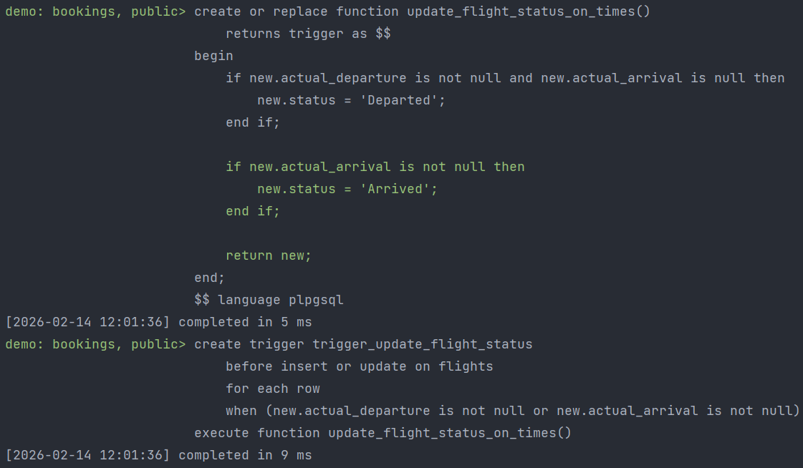


## Задание 6

**Шаги:**
1. Создать триггер, который предотвращает назначение одного места разным пассажирам на одном рейсе.

**Скрипт:**
```postgresql
create or replace function check_duplicate_seat()
    returns trigger as $$
declare
    existing_seat record;
begin
    select bp.seat_no, bp.flight_id
    into existing_seat
    from boarding_passes bp
    where bp.flight_id = new.flight_id
      and bp.seat_no = new.seat_no
      and bp.ticket_no != new.ticket_no;

    if existing_seat is not null then
        raise exception 'место % на рейсе % уже занято другим пассажиром', new.seat_no, new.flight_id;
    end if;

    return new;
end;
$$ language plpgsql;

create trigger trigger_check_duplicate_seat
    before insert or update on boarding_passes
    for each row
execute function check_duplicate_seat();
```

Результат:

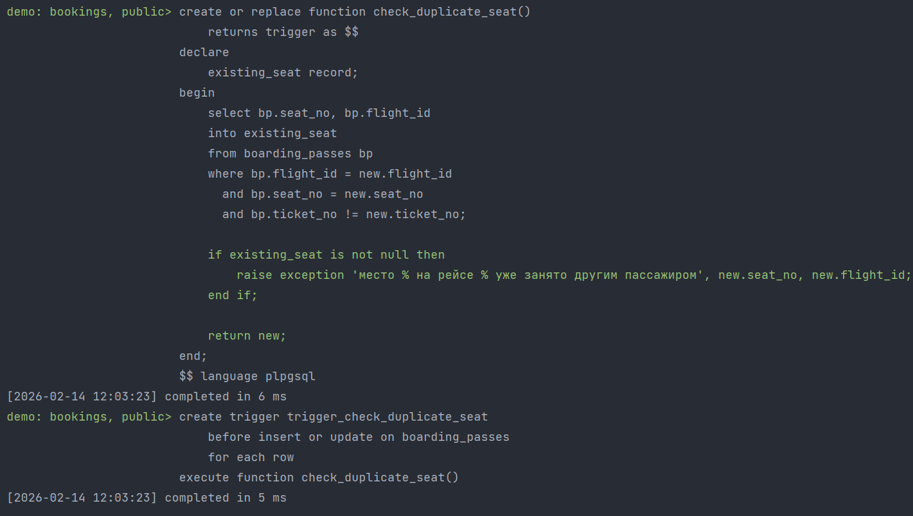


## Задание 8

**Шаги:**
1. Создать триггер, который генерирует уникальный boarding_no для каждого рейса при вставке в boarding_passes.

**Скрипт:**
```postgresql
create or replace function generate_boarding_no()
    returns trigger as $$
begin
    select coalesce(max(boarding_no), 0) + 1
    into new.boarding_no
    from boarding_passes
    where flight_id = new.flight_id;

    return new;
end;
$$ language plpgsql;

create trigger trigger_generate_boarding_no
    before insert on boarding_passes
    for each row
    when (new.boarding_no is null)
execute function generate_boarding_no();
```

Результат:

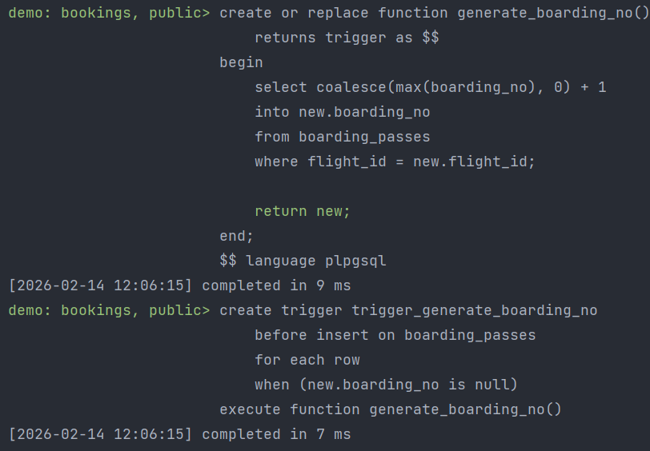


## Задание 9

**Шаги:**
1. Создать триггер, который проверяет, что дальность полета самолета достаточна для расстояния между аэропортами

**Скрипт:**
```postgresql
create or replace function check_aircraft_range()
    returns trigger as $$
declare
    departure_coords point;
    arrival_coords point;
    flight_distance numeric;
    aircraft_max_range integer;
begin
    select coordinates into departure_coords
    from airports
    where airport_code = new.departure_airport;

    select coordinates into arrival_coords
    from airports
    where airport_code = new.arrival_airport;

    flight_distance := 111.2 * sqrt(
                power((degrees(arrival_coords[1]) - degrees(departure_coords[1])), 2) +
                power((degrees(arrival_coords[0]) - degrees(departure_coords[0])), 2)
        );

    select range into aircraft_max_range
    from aircrafts
    where aircraft_code = new.aircraft_code;

    if aircraft_max_range < flight_distance then
        raise exception 'самолет % не имеет достаточной дальности для рейса %–%',
            new.aircraft_code, new.departure_airport, new.arrival_airport;
    end if;

    return new;
end;
$$ language plpgsql;

create trigger trigger_check_aircraft_range
    before insert or update on flights
    for each row
execute function check_aircraft_range();
```

Результат:

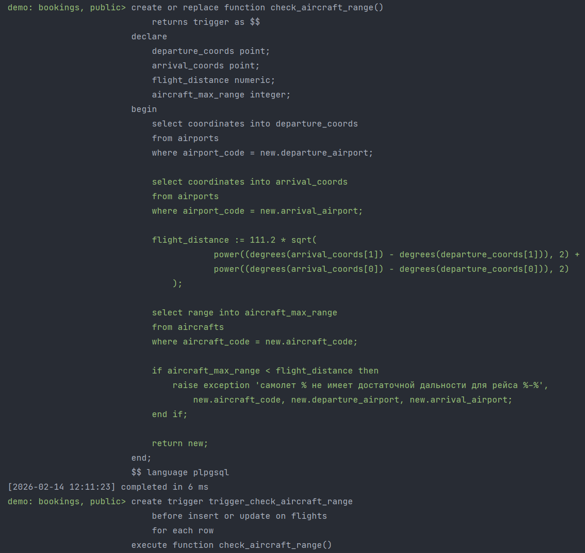


## Задание 10

**Шаги:**
1. Создать триггер, который запрещает изменять расписание рейса менее чем за 24 часа до вылета.

**Скрипт:**
```postgresql
create or replace function check_schedule_change_time()
    returns trigger as $$
begin
    if new.scheduled_departure < (current_timestamp + interval '24 hours') then
        raise exception 'нельзя изменять расписание рейса менее чем за 24 часа до вылета';
    end if;
    return new;
end;
$$ language plpgsql;

create trigger trigger_check_schedule_change
    before update of scheduled_departure, scheduled_arrival on flights
    for each row
execute function check_schedule_change_time();
```

Результат:

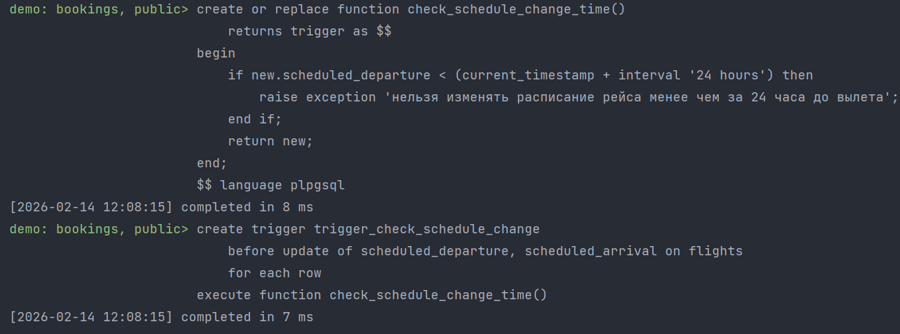


## Задание 11

**Шаги:**
1. Создать триггер, который проверяет, что бронирование создается не раньше чем за 11 месяцев до вылета.

**Скрипт:**
```postgresql
create or replace function validate_booking_date()
    returns trigger as $$
declare
    first_flight_departure timestamp with time zone;
begin
    select min(f.scheduled_departure)
    into first_flight_departure
    from ticket_flights tf
             join flights f on tf.flight_id = f.flight_id
             join tickets t on tf.ticket_no = t.ticket_no
    where t.book_ref = new.book_ref;
    if first_flight_departure is not null and new.book_date < (first_flight_departure - interval '11 months') then
        raise exception 'бронирование нельзя создавать ранее чем за 11 месяцев до вылета';
    end if;

    return new;
end;
$$ language plpgsql;

create trigger trigger_validate_booking_date
    before insert or update on bookings
    for each row
execute function validate_booking_date();
```

Результат:

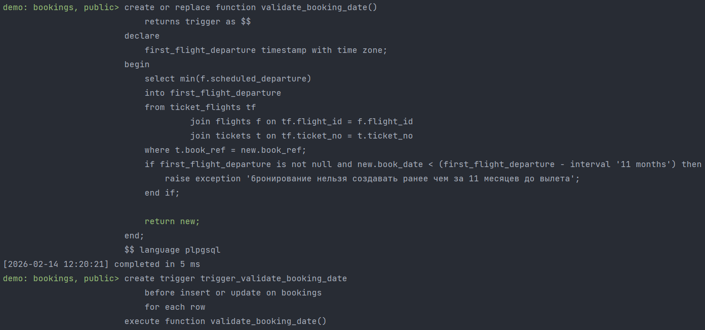


## Задание 12

**Шаги:**
1. Создать триггер, который при вставке в bookings автоматически устанавливает book_date в текущее время, если оно не 
указано.

**Скрипт:**
```postgresql
create or replace function set_booking_date()
    returns trigger as $$
begin
    if new.book_date is null then
        new.book_date = current_timestamp;
    end if;
    return new;
end;
$$ language plpgsql;

create trigger trigger_set_booking_date
    before insert on bookings
    for each row
execute function set_booking_date();
```

Результат:

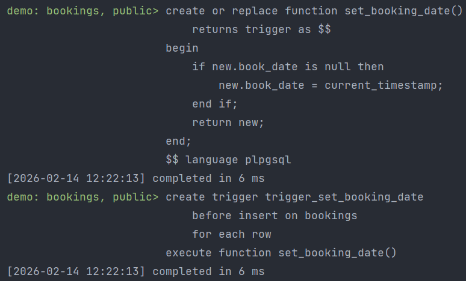


## Задание 13

**Шаги:**
1. Создать триггер, который проверяет, что класс обслуживания в ticket_flights соответствует классу выбранного места
в boarding_passes.

**Скрипт:**
```postgresql
create or replace function check_fare_condition_match()
    returns trigger as $$
declare
    ticket_fare text;
    seat_fare text;
begin
    select fare_conditions
    into ticket_fare
    from ticket_flights
    where ticket_no = new.ticket_no
      and flight_id = new.flight_id;
    select s.fare_conditions
    into seat_fare
    from boarding_passes bp
             join seats s on bp.seat_no = s.seat_no
             join flights f on bp.flight_id = f.flight_id
    where bp.ticket_no = new.ticket_no
      and bp.flight_id = new.flight_id
      and s.aircraft_code = f.aircraft_code;
    if ticket_fare <> seat_fare then
        raise exception 'класс обслуживания в билете (%) не соответствует классу места (%)', ticket_fare, seat_fare;
    end if;

    return new;
end;
$$ language plpgsql;

create trigger trigger_check_fare_condition
    before insert or update on boarding_passes
    for each row
execute function check_fare_condition_match();
```

Результат:

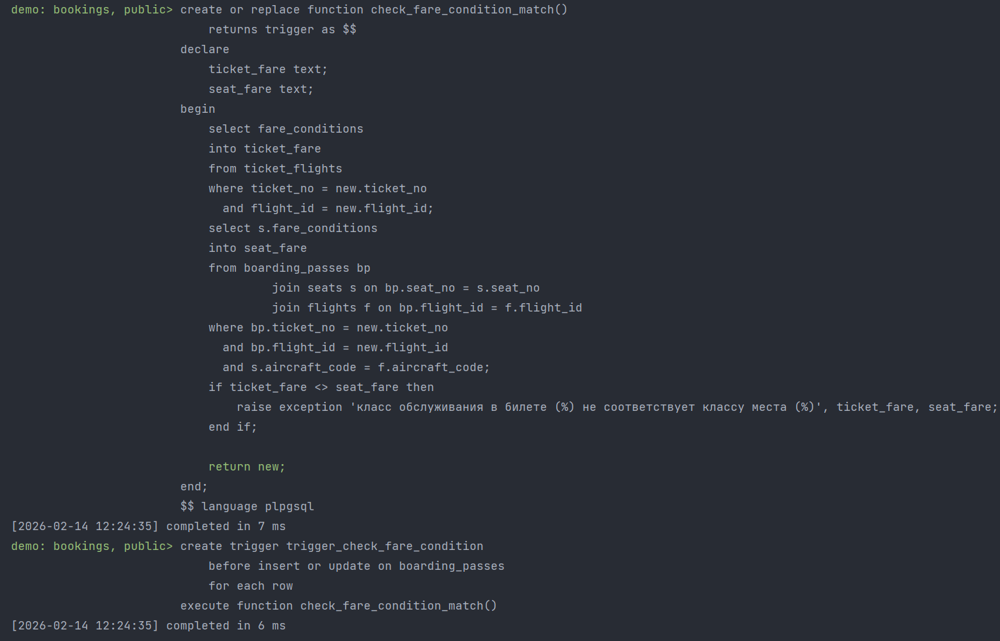


## Задание 14

**Шаги:**
1. Создать триггер, который запрещает удаление рейсов, на которые уже проданы билеты.

**Скрипт:**
```postgresql
create or replace function prevent_flight_deletion()
    returns trigger as $$
declare
    tickets_count integer;
begin
    select count(*)
    into tickets_count
    from ticket_flights tf
    where tf.flight_id = old.flight_id;
    if tickets_count > 0 then
        raise exception 'нельзя удалить рейс % — на него уже проданы билеты', old.flight_id;
    end if;

    return old;
end;
$$ language plpgsql;

create trigger trigger_prevent_flight_deletion
    before delete on flights
    for each row
execute function prevent_flight_deletion();
```

Результат:

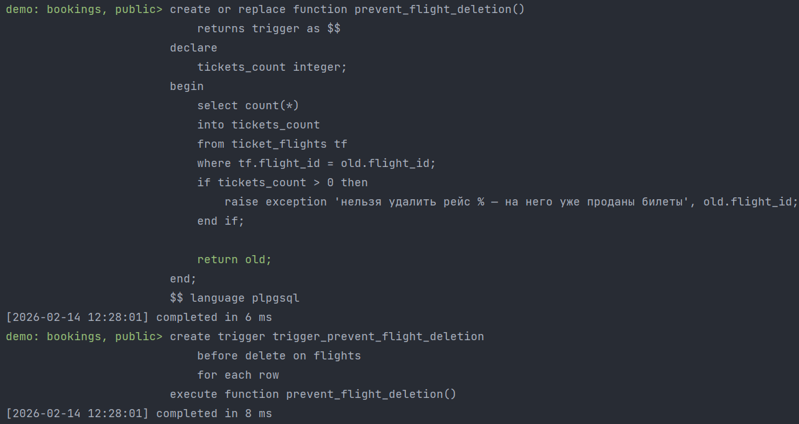


## Задание 15

**Шаги:**
1. Создать триггер, который после любого изменения в таблице flights записывает старые и новые значения в таблицу аудита.

**Скрипт:**
```postgresql
create table if not exists flights_audit (
                                             audit_id serial primary key,
                                             flight_id integer,
                                             operation varchar(10),
                                             old_data jsonb,
                                             new_data jsonb,
                                             changed_at timestamp with time zone default current_timestamp,
                                             changed_by text default current_user
);

create or replace function log_flight_changes()
    returns trigger as $$
begin
    if tg_op = 'UPDATE' then
        insert into flights_audit (flight_id, operation, old_data, new_data)
        values (old.flight_id, 'UPDATE', to_jsonb(old), to_jsonb(new));
    elsif tg_op = 'DELETE' then
        insert into flights_audit (flight_id, operation, old_data)
        values (old.flight_id, 'DELETE', to_jsonb(old));
    elsif tg_op = 'INSERT' then
        insert into flights_audit (flight_id, operation, new_data)
        values (new.flight_id, 'INSERT', to_jsonb(new));
    end if;
    return new;
end;
$$ language plpgsql;

create trigger trigger_log_flight_changes
    after insert or update or delete on flights
    for each row
execute function log_flight_changes();
```

Результат:

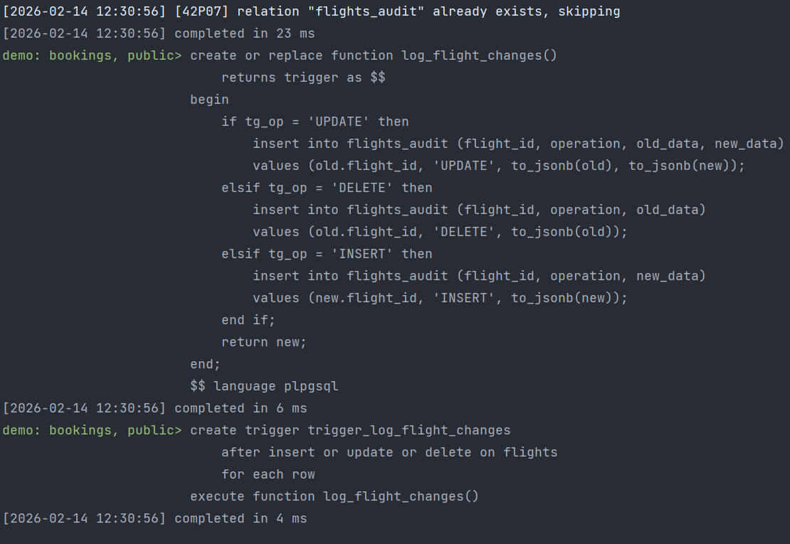


## Задание 16

**Шаги:**
1. Создать триггер, который после изменения статуса рейса на 'Cancelled' создает записи в таблице уведомлений для всех 
пассажиров.

**Скрипт:**
```postgresql
create materialized view routes as
select
    f.flight_id,
    f.flight_no,
    f.scheduled_departure,
    f.scheduled_arrival,
    dep.airport_code as departure_airport_code,
    dep.airport_name as departure_airport_name,
    dep.city as departure_city,
    arr.airport_code as arrival_airport_code,
    arr.airport_name as arrival_airport_name,
    arr.city as arrival_city,
    f.status,
    f.aircraft_code,
    a.model as aircraft_model,
    count(tf.ticket_no) as booked_tickets,
    sum(tf.amount) as total_revenue
from
    flights f
        join airports dep on f.departure_airport = dep.airport_code
        join airports arr on f.arrival_airport = arr.airport_code
        join aircrafts a on f.aircraft_code = a.aircraft_code
        left join ticket_flights tf on f.flight_id = tf.flight_id
group by
    f.flight_id, f.flight_no, f.scheduled_departure, f.scheduled_arrival,
    dep.airport_code, dep.airport_name, dep.city,
    arr.airport_code, arr.airport_name, arr.city,
    f.status, f.aircraft_code, a.model
with data;
create or replace function refresh_routes_mv()
returns trigger as $$
begin
    refresh materialized view routes;
    return null;
end;
$$ language plpgsql;

create trigger trigger_refresh_routes
after insert or update or delete on flights
for each statement
execute function refresh_routes_mv();
```

Результат:

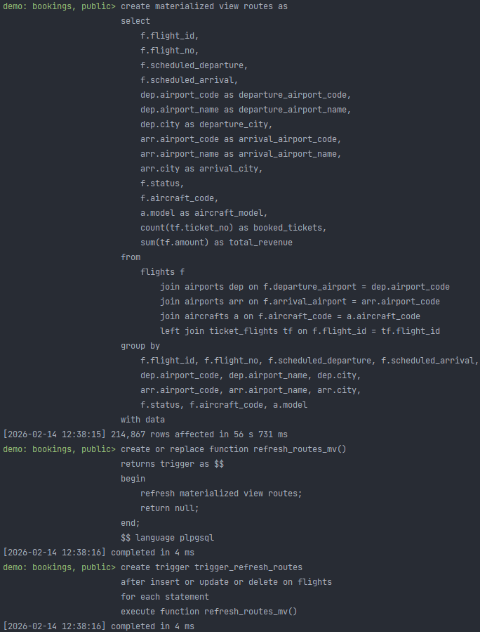


## Задание 17

**Шаги:**
1. Создать триггер, который после операций с ticket_flights обновляет статистику продаж в отдельной таблице.

**Скрипт:**
```postgresql
create table if not exists notifications (
    notification_id serial primary key,
    ticket_no char(13),
    flight_id integer,
    message text,
    sent_at timestamp with time zone default current_timestamp,
    status varchar(20) default 'pending'
);

create or replace function send_cancellation_notifications()
returns trigger as $$
begin
    if new.status = 'Cancelled' and (old.status is null or old.status != 'Cancelled') then
        insert into notifications (ticket_no, flight_id, message)
        select tf.ticket_no, new.flight_id,
               'Рейс ' || new.flight_no || ' отменён. Дата вылета: ' ||
               to_char(new.scheduled_departure, 'DD.MM.YYYY HH24:MI')
        from ticket_flights tf
        where tf.flight_id = new.flight_id;
    end if;
    return new;
end;
$$ language plpgsql;

create trigger trigger_send_cancellation_notifications
after update on flights
for each row
when (new.status = 'Cancelled')
execute function send_cancellation_notifications();
```

Результат:

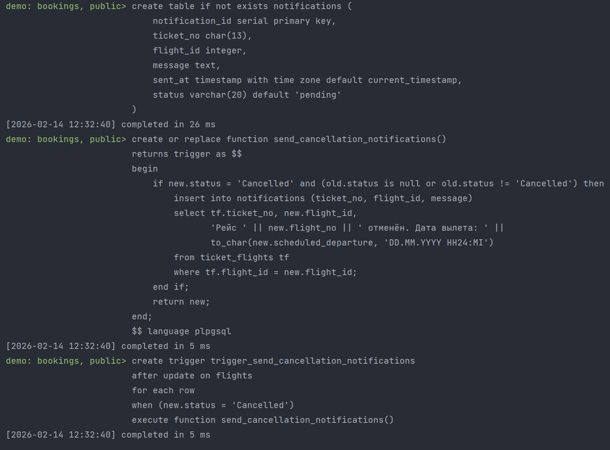


## Задание 18

**Шаги:**
1. Создать триггер, который после операций с ticket_flights обновляет статистику продаж в отдельной таблице.

**Скрипт:**
```postgresql
create table if not exists sales_stats (
                                           flight_id integer primary key,
                                           total_tickets_sold bigint not null default 0,
                                           total_revenue numeric(12, 2) not null default 0.00,
                                           last_updated timestamp with time zone not null default current_timestamp
);
create or replace function update_sales_stats()
    returns trigger as $$
begin
    if tg_op in ('INSERT', 'UPDATE') then
        update sales_stats
        set
            total_tickets_sold = subq.ticket_count,
            total_revenue = subq.total_amount,
            last_updated = current_timestamp
        from (
                 select
                     tf.flight_id,
                     count(*) as ticket_count,
                     sum(tf.amount) as total_amount
                 from ticket_flights tf
                 where tf.flight_id = new.flight_id
                 group by tf.flight_id
             ) subq
        where sales_stats.flight_id = subq.flight_id;

        if not found then
            insert into sales_stats (flight_id, total_tickets_sold, total_revenue)
            select
                tf.flight_id,
                count(*) as ticket_count,
                sum(tf.amount) as total_amount
            from ticket_flights tf
            where tf.flight_id = new.flight_id
            group by tf.flight_id;
        end if;

    elsif tg_op = 'DELETE' then
        update sales_stats
        set
            total_tickets_sold = subq.ticket_count,
            total_revenue = subq.total_amount,
            last_updated = current_timestamp
        from (
                 select
                     tf.flight_id,
                     count(*) as ticket_count,
                     sum(tf.amount) as total_amount
                 from ticket_flights tf
                 where tf.flight_id = old.flight_id
                 group by tf.flight_id
             ) subq
        where sales_stats.flight_id = subq.flight_id;

        delete from sales_stats
        where flight_id = old.flight_id
          and total_tickets_sold = 0
          and total_revenue = 0;
    end if;

    return null;
end;
$$ language plpgsql;

create trigger trigger_update_sales_stats
    after insert or update or delete on ticket_flights
    for each row
execute function update_sales_stats();
```

Результат:

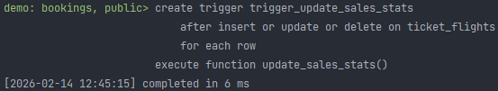


## Задание 19

**Шаги:**
1. Создать триггер, который после вставки в boarding_passes проверяет, что пассажир действительно имеет билет на этот
рейс.

**Скрипт:**
```postgresql
create or replace function validate_passenger_ticket()
returns trigger as $$
declare
    ticket_exists boolean;
begin
    select exists (
        select 1
        from ticket_flights tf
        join tickets t on tf.ticket_no = t.ticket_no
        where tf.ticket_no = new.ticket_no
          and tf.flight_id = new.flight_id
    ) into ticket_exists;
    if not ticket_exists then
        raise exception 'пассажир не имеет билета на рейс %', new.flight_id;
    end if;

    return new;
end;
$$ language plpgsql;

create trigger trigger_validate_passenger_ticket
before insert on boarding_passes
for each row
execute function validate_passenger_ticket();
```

Результат:

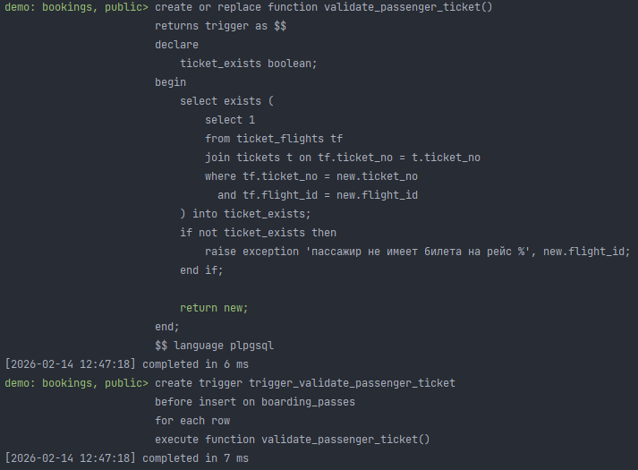


## Задание 20

**Шаги:**
1. Создать триггер, который после изменения статуса рейса на 'Arrived' переносит данные о рейсе в таблицу архивов.

**Скрипт:**
```postgresql
create table if not exists flights_archive (
    archive_id serial primary key,
    flight_id integer not null,
    flight_no char(6),
    scheduled_departure timestamp with time zone,
    scheduled_arrival timestamp with time zone,
    departure_airport char(3),
    arrival_airport char(3),
    status varchar(20),
    aircraft_code char(3),
    actual_departure timestamp with time zone,
    actual_arrival timestamp with time zone,
    archived_at timestamp with time zone default current_timestamp
);

create or replace function archive_arrived_flight()
returns trigger as $$
begin
    if new.status = 'Arrived' and (old.status is null or old.status != 'Arrived') then
        insert into flights_archive (
            flight_id,
            flight_no,
            scheduled_departure,
            scheduled_arrival,
            departure_airport,
            arrival_airport,
            status,
            aircraft_code,
            actual_departure,
            actual_arrival
        ) values (
            new.flight_id,
            new.flight_no,
            new.scheduled_departure,
            new.scheduled_arrival,
            new.departure_airport,
            new.arrival_airport,
            new.status,
            new.aircraft_code,
            new.actual_departure,
            new.actual_arrival
        );
    end if;
    return new;
end;
$$ language plpgsql;

create trigger trigger_archive_arrived_flight
after update on flights
for each row
when (new.status = 'Arrived')
execute function archive_arrived_flight();
```

Результат:

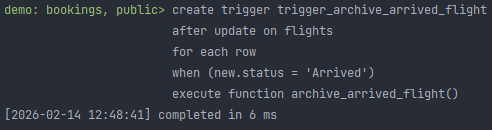