# Лабораторная работа №12

# Задание 1

**Шаги:**
1. Для каждого аэропорта отправления вывести рейсы, пронумерованные по дате вылета с использованием row_number().

**Скрипт:**
```postgresql
select 
    row_number() over (order by f.scheduled_departure) "Порядковый номер",
    f.flight_id as "Идентификатор рейса",
    a.airport_name as "Аэропорт отправления"
from airports a 
join flights f
    on a.airport_code = f.departure_airport
```
Результат:

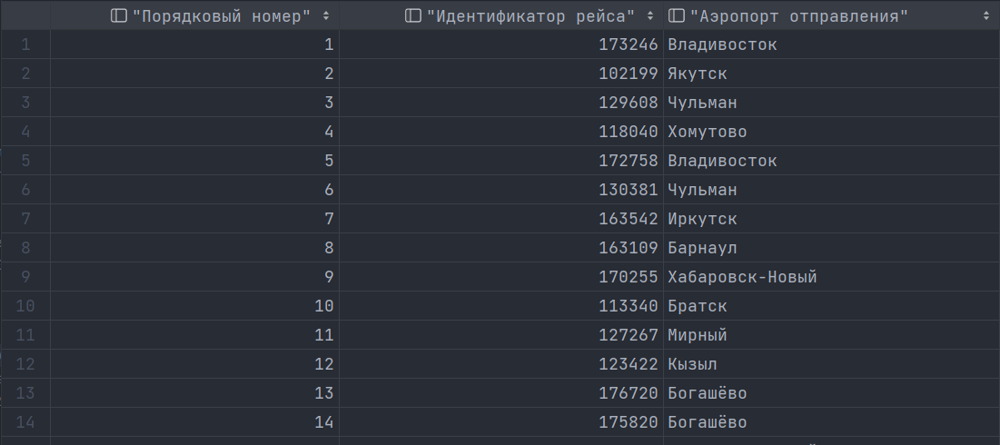


# Задание 2

**Шаги:**
1. Используя RANK(), составить рейтинг рейсов по количеству проданных билетов.

**Скрипт:**
```postgresql
select 
    tf.flight_id,
    count (tf.ticket_no) as tickets_sold,
    rank() over (order by count(tf.ticket_no) desc) as sales_rank
from flights f
join ticket_flights tf 
    on f.flight_id = tf.flight_id
group by tf.flight_id
```
Результат:

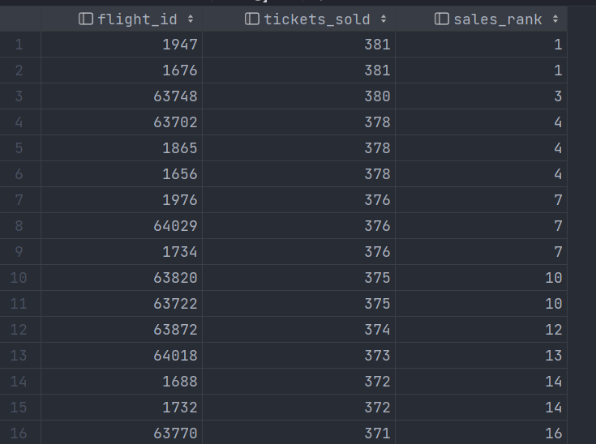


# Задание 3

**Шаги:**
1. Для каждого рейса вывести стоимость билета и ее процент от максимальной стоимости в том же классе обслуживания с 
использованием max() over.

**Скрипт:**
```postgresql
select
    tf.flight_id,
    tf.amount as "Стоимость билета",
    tf.fare_conditions as "Класс",
    max(amount) over (partition by f.flight_id, tf.fare_conditions) as "Максимальная стоимость билета в классе",
    tf.amount / max(amount) over (partition by f.flight_id, tf.fare_conditions) as "Процент стоимости билета от максимальной стоимости билета в классе"
from flights f
join ticket_flights tf 
    on f.flight_id = tf.flight_id
```
Результат:


# Задание 4

**Шаги:**
1. Для каждого рейса вывести его продолжительность и среднюю продолжительность рейсов между теми же аэропортами с
использованием avg() over.

**Скрипт:**
```postgresql
select
    f.flight_id as "Идентификатор рейса",
    f.scheduled_arrival - f.scheduled_departure as "Продолжительность",
    avg(f.scheduled_arrival - f.scheduled_departure) over (partition by da.airport_code, aa.airport_code)
from flights f 
join airports da
    on f.departure_airport = da.airport_code
join airports aa
    on f.arrival_airport = aa.airport_code
```
Результат:

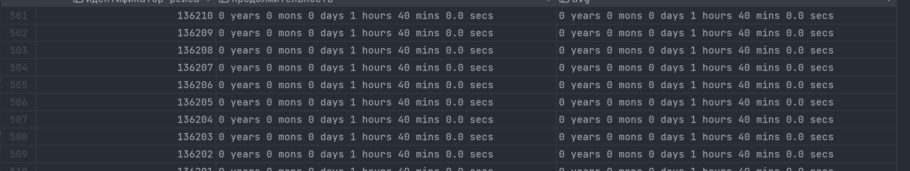


# Задание 5

**Шаги:**
1. Рассчитать накопительную сумму total_amount по датам бронирования с использованием sum() over с упорядочиванием
по book_date.

**Скрипт:**
```postgresql
select
    b.book_ref as "Ссылка",
    b.total_amount as "Сумма",
    sum(b.total_amount) over (order by b.book_date) as "Накопительная сумма"
from bookings b
```
Результат:

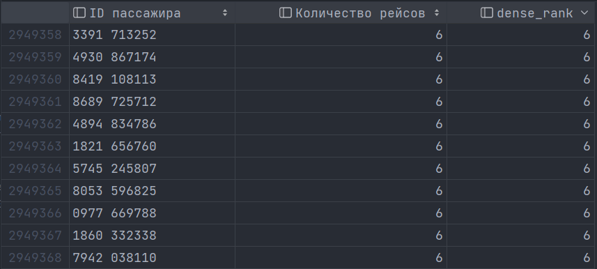


# Задание 6

**Шаги:**
1. Использовать dense_rank();
2. Составить рейтинг пассажиров по общему количеству перелетов.

**Скрипт:**
```postgresql
select
    t.passenger_id as "ID пассажира",
    count(tf.flight_id) as "Количество рейсов",
    dense_rank() over (order by count(tf.flight_id))
from tickets t
join ticket_flights tf
    on tf.ticket_no = t.ticket_no
group by t.passenger_id
```
Результат:


# Задание 7

**Шаги:**
1. Для каждого рейса вывести процент занятых мест и средний процент по тому же маршруту.

**Скрипт:**
```postgresql
create or replace view aircraft_seats as (
    select 
        a.aircraft_code,
        count(*) as seats_count
    from aircrafts a
    join seats s 
        on a.aircraft_code = s.aircraft_code
    group by a.aircraft_code
);
create or replace view flight_seats as (
    select 
        tf.flight_id,
        count(*) as passengers_count
    from ticket_flights tf
    group by tf.flight_id
);

select f.flight_id, fs.count "Занято", a.count "Всего"
from flights f
join flight_seats fs 
    on f.flight_id = fs.flight_id
join aircraft_seats a
    on a.aircraft_code = f.aircraft_code
    
select 
    f.flight_id,
    fs.passengers_count as "Число пассажиров",
    a.seats_count as "Количество мест",
    round(fs.passengers_count / a.seats_count::numeric, 2) * 100 as "% заполненость",
    round(avg(fs.passengers_count / a.seats_count::numeric) 
        over (partition by f.departure_airport, f.arrival_airport), 2) * 100 as "% заполненности в среднем на том же маршруте"
from flights f
join flight_seats fs
    on f.flight_id = fs.flight_id
join aircraft_seats a
    on a.aircraft_code = f.aircraft_code
```
Результат:

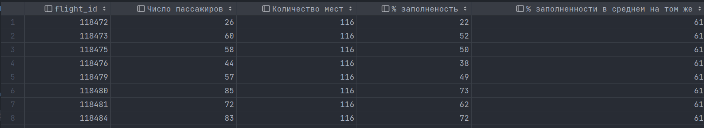


# Задание 8

**Шаги:**
1. Для каждого рейса вывести время до следующего рейса из того же аэропорта;
2. Использовать lead();

**Скрипт:**
```postgresql
select 
    f.flight_id as "ID рейса",
    f.scheduled_departure as "Время отправления",
    lead(f.scheduled_departure) over (order by f.scheduled_departure) as "Время отправления следующего самолета"
from flights f
```
Результат:

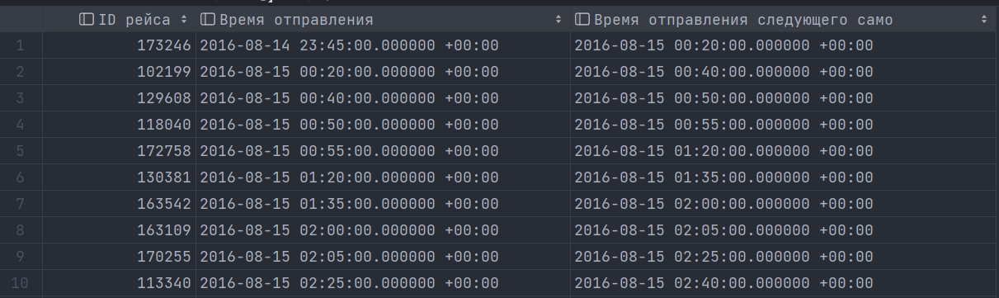


# Задание 9

**Шаги:**
1. Вывести ежемесячную сумму бронирований и разницу с предыдущим месяцем;
2. Использовать lag();

**Скрипт:**
```postgresql
select 
    to_char(b.book_date, 'yyyy-mm') as "Месяц",
    sum(b.total_amount) as "Сумма текущего месяца",
    lag(sum(b.total_amount)) over (order by to_char(b.book_date, 'yyyy-mm')) as "Сумма предыдущего месяца"
from bookings b
group by to_char(b.book_date, 'yyyy-mm');
```
Результат:

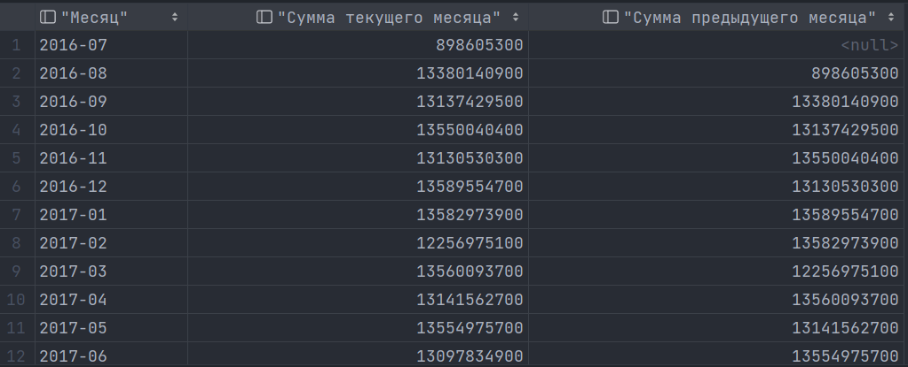


# Задание 10

**Шаги:**
1. Разбить билеты на 4 ценовые категории по стоимости;
2. Использовать ntile(4).

**Скрипт:**
```postgresql
select 
    t.ticket_no as "ticket_number",
    tf.amount as "price",
    ntile(4) over (order by tf.amount) as price_quartile
from tickets t
join ticket_flights tf
    on t.ticket_no = tf.ticket_no
```

Результат:

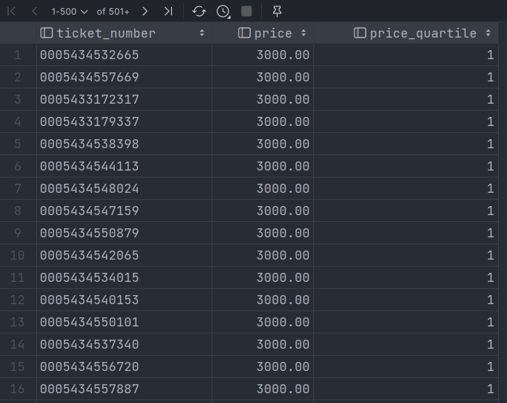


# Задание 11

**Шаги:**
1. Для каждого пассажира найти дату его первого бронирования;
2. Использовать first_value().

**Скрипт:**
```postgresql
select 
    t.passenger_id as passenger_id,
    first_value(b.book_date) over (partition by passenger_id order by b.book_date) as first_booking_date
from tickets t 
join bookings b 
    on t.book_ref = b.book_ref
```

Результат:

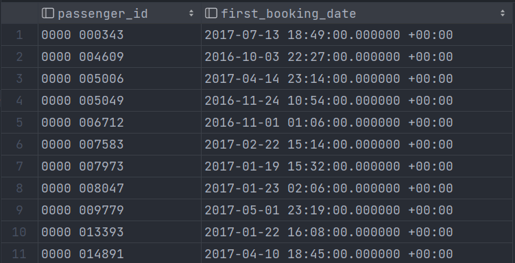


# Задание 12

**Шаги:**
1. Для каждого аэропорта вывести количество вылетов и разницу с аэропортом с максимальным количеством вылетов.

**Скрипт:**
```postgresql
with airports_departure_count as (
    select
        a.airport_code as airport_code,
        count(a.airport_code) over (partition by a.airport_code) as departure_count
    from airports a
    join flights f
        on f.departure_airport = a.airport_code
), max_departure_count as (
    select max(departure_count) as max
    from airports_departure_count
)

select distinct 
    airport_code,
    departure_count, 
    max_departure_count.max - departure_count as difference
from airports_departure_count
cross join max_departure_count

```

Результат:

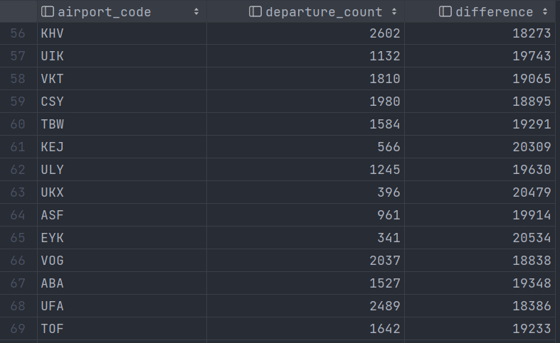


# Задание 13

**Шаги:**
1. Составьте рейтинг моделей самолетов по максимальной дальности полета;
2. Использовать rank().

**Скрипт:**
```postgresql 
select
    a.model as "Модель",
    rank() over (order by a.range desc )
from aircrafts a 
```

Результат:

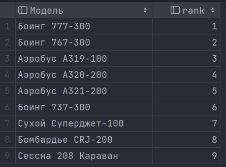


# Задание 14

**Шаги:**
1. Вывести скользящее среднее суммы бронирований за 7 дней;
2. Использовать функции с rows.

**Скрипт:**
```postgresql 
select
    b.book_ref,
    b.total_amount,
    sum(b.total_amount) over (order by b.book_date rows between 7 preceding and current row) as last_7_days
from bookings b
```

Результат:

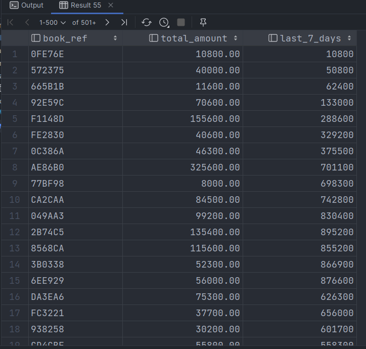


# Задание 15

**Шаги:**
1. Для каждого пассажира найдите максимальный промежуток между перелетами и среднее время между
перелетами.

**Скрипт:**
```postgresql 
select
    t.passenger_id,
    max(f.actual_arrival - f.actual_departure) over (partition by t.passenger_id),
    avg(f.actual_arrival - f.actual_departure) over (partition by t.passenger_id)
from tickets t
join ticket_flights tf 
    on t.ticket_no = tf.ticket_no
join flights f 
    on tf.flight_id = f.flight_id
```

Результат:

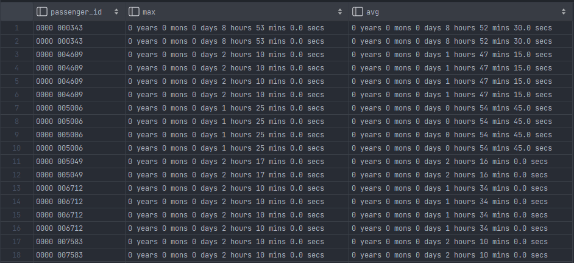


# Задание 16

**Шаги:**
1. Для каждого билета вывести его стоимость и медианную стоимость билетов на тот же рейс.

**Скрипт:**
```postgresql 
select 
    t.ticket_no,
    tf.amount,
    avg(tf.amount) over (partition by f.flight_id)
    
from tickets t 
join ticket_flights tf 
    on t.ticket_no = tf.ticket_no
join flights f 
    on tf.flight_id = f.flight_id
```

Результат:

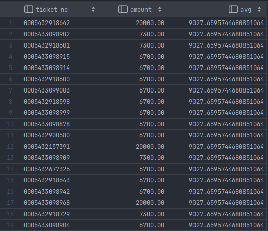


# Задание 17

**Шаги:**
1. Разбить рейсы на группы по времени вылета (утро, день, вечер, ночь);
2. Проанализировать среднюю заполненность для каждой группы.

**Скрипт:**
```postgresql 
with flight_per_group as (
    select 
        f.flight_id,
        case
            when f.scheduled_departure::time between '06:00' and '11:00' then 'утро'
            when f.scheduled_departure::time between '12:00' and '16:00' then 'день'
            when f.scheduled_departure::time between '17:00' and '22:00' then 'вечер'
            else 'ночь'
        end as time_group
    from flights f
), time_group_per_flights as (
    select
        to_char(f.actual_departure, 'yyyy-mm-dd') as day,
        fpg.time_group,
        count(*) as flights_count
    from flights f
    join flight_per_group fpg
        on f.flight_id = fpg.flight_id
    group by fpg.time_group, to_char(f.actual_departure, 'yyyy-mm-dd')
)

select * 
from (
        select time_group,
             avg(flights_count) over (partition by time_group) as average
        from time_group_per_flights
) as tga
group by time_group, average
```

Результат:

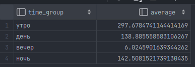


# Задание 18

**Шаги:**
1. Составить рейтинг аэропортов по общему количеству обслуженных пассажиров с разбивкой по месяцам.

**Скрипт:**
```postgresql 
with airport_passengers_in as (
    select 
        a.airport_code,
        to_char(f.actual_arrival, 'yyyy-mm') as month,
        count(*) as passengers_count_in
    from airports a 
    join flights f 
        on a.airport_code = f.arrival_airport
    join ticket_flights tf 
        on f.flight_id = tf.flight_id
    group by a.airport_code, f.actual_arrival
), airport_passengers_out as (
    select
        a.airport_code,
        to_char(f.actual_departure, 'yyyy-mm') as month,
        count(*) as passengers_count_out
    from airports a
    join flights f
        on a.airport_code = f.departure_airport
    join ticket_flights tf
        on f.flight_id = tf.flight_id
    group by a.airport_code, f.actual_departure
)

select 
    api.airport_code,
    api.month,
    sum(api.passengers_count_in + apo.passengers_count_out) as Пассажиры,
    dense_rank() over (order by sum(api.passengers_count_in + apo.passengers_count_out)) as Рейтинг
from airport_passengers_in api
join airport_passengers_out apo
    on api.airport_code = apo.airport_code
    and api.month = apo.month
group by api.airport_code, api.month
```

Результат:

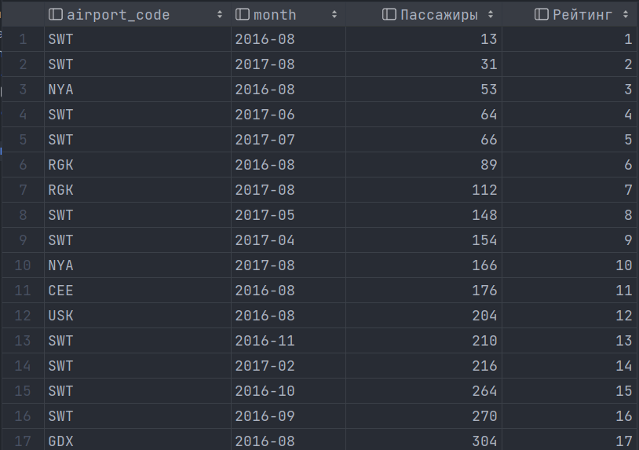


# Задание 19

**Шаги:**
1. Для каждого пассажира определить, в каком квартиле он находится по количеству перелетов за последний год.

**Скрипт:**
```postgresql 
select 
    t.passenger_id,
    count(*),
    ntile(4) over (order by count(*) desc )
from flights f 
join ticket_flights tf 
    on f.flight_id = tf.flight_id
join tickets t 
    on tf.ticket_no = t.ticket_no
where to_char(f.scheduled_departure, 'yyyy') = '2017'
group by t.passenger_id
```

Результат:


# Задание 20

**Шаги:**
1. Вывести недельную статистику бронирований и процент изменения относительно предыдущей недели.

**Скрипт:**
```postgresql 
with bookings_count_per_week as (
    select extract(week from b.book_date) as week,
           extract(year from b.book_date) as year,
           count(*)                       as bookings_count

    from bookings b
    group by extract(week from b.book_date),
             extract(year from b.book_date)
)

select 
    b.year,
    b.week,
    b.bookings_count,
    round(lag(bookings_count) over (order by b.year, b.week) / bookings_count::numeric, 2) * 100 as percent
from bookings_count_per_week b
```

Результат:

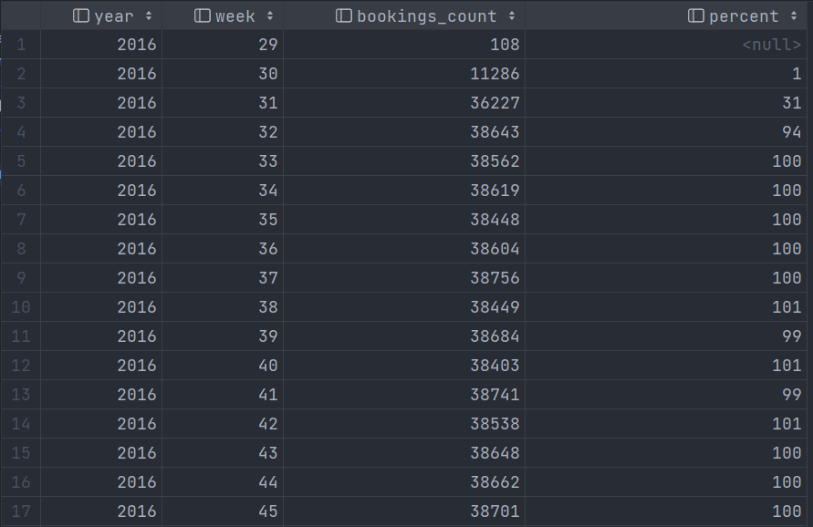


# Задание 21

**Шаги:**
1. Для каждого самолета вывести распределение мест по классам обслуживания в процентном соотношении.

**Скрипт:**
```postgresql
with aircraft_class_seats as (
    select
        a.aircraft_code,
        s.fare_conditions,
        count(*) as seats_count
    from aircrafts a
    join seats s
        on a.aircraft_code = s.aircraft_code
    group by
        a.aircraft_code,
        s.fare_conditions
), aircraft_per_seats_count as (
    select
        a.aircraft_code,
        sum(a.seats_count) as summa
    from aircraft_class_seats a
    group by a.aircraft_code
)

select 
    acs.aircraft_code,
    acs.fare_conditions,
    round(seats_count / summa, 2) * 100 as percentage
from aircraft_class_seats acs 
join aircraft_per_seats_count apsc
    on acs.aircraft_code = apsc.aircraft_code
```

Результат:

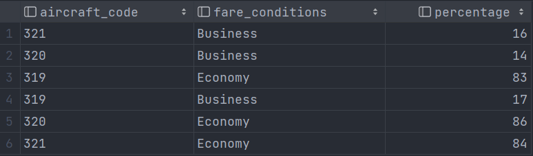


# Задание 22

**Шаги:**
1. Определить самые популярные маршруты в каждом месяце;
2. Использовать row_number() и partition by.

**Скрипт:**

```postgresql
with route_per_count as (
    select 
        f.departure_airport,
        f.arrival_airport,
        count(*) over (partition by f.departure_airport, f.arrival_airport) as route_count
    from flights f
), route_per_count_grouped as (
    select
        rpc.arrival_airport,
        rpc.departure_airport,
        min(rpc.route_count) as route_count
    from route_per_count rpc
    group by rpc.arrival_airport, rpc.departure_airport
)

select 
    rpcg.departure_airport,
    rpcg.arrival_airport,
    rpcg.route_count,
    row_number() over (order by rpcg.route_count desc)
from route_per_count_grouped rpcg
```

Результат:

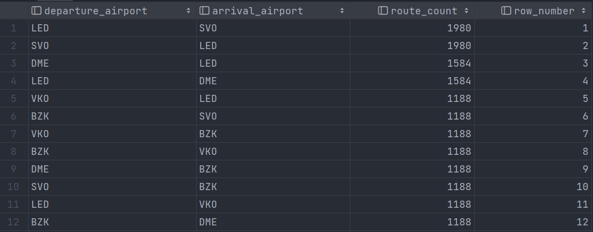


# Задание 23

**Шаги:**
1. Для каждого бронирования вывести время между бронированием и вылетом первого рейса в этом бронировании.

**Скрипт:**

```postgresql
select 
    b.book_ref,
    b.book_date,
    min(f.actual_departure) over (partition by b.book_ref) as first_flight,
    min(f.actual_departure) over (partition by b.book_ref) - b.book_date as difference
from bookings b 
join tickets t 
    on b.book_ref = t.book_ref
join ticket_flights tf 
    on t.ticket_no = tf.ticket_no
join flights f 
    on tf.flight_id = f.flight_id
```

Результат:

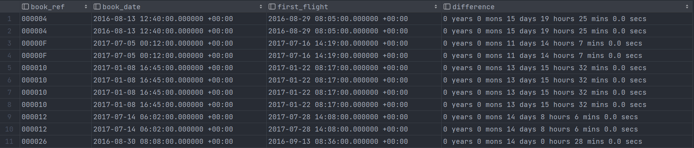


# Задание 24

**Шаги:**
1. Для каждого рейса вывести его доход и процент от общего дохода рейсов на том же маршруте.

**Скрипт:**

```postgresql
select
    fiscs.flight_id,
    min(fiscs.sales) as sales,
    min(fiscs.common_sales) as common_sales,
    min(round(fiscs.sales / fiscs.common_sales::numeric, 5) * 100) as percentage
from (
    select
        f.flight_id,
        sum(tf.amount) over (partition by f.flight_id) as sales,
        sum(tf.amount) over (partition by f.departure_airport, f.arrival_airport) as common_sales
    from flights f
    join ticket_flights tf
        on f.flight_id = tf.flight_id  
) as fiscs
group by fiscs.flight_id;
```

Результат:

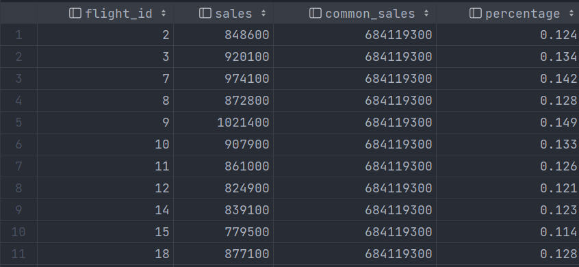


# Задание 25

**Шаги:**
1. Рассчитайте кумулятивное количество пассажиров для каждого аэропорта по месяцам.

**Скрипт:**

```postgresql
with passengers_in as (
    select 
        a.airport_code,
        to_char(f.actual_arrival, 'yyyy-mm-dd') as day,
        count(*) as passengers_count
    from airports a
    join flights f
        on f.arrival_airport = a.airport_code
    join ticket_flights tf 
        on f.flight_id = tf.flight_id
    group by 
        a.airport_code,
        to_char(f.actual_arrival, 'yyyy-mm-dd')
), passengers_out as (
    select
        a.airport_code,
        to_char(f.actual_departure, 'yyyy-mm-dd') as day,
        count(*) as passengers_count
    from airports a
             join flights f
                  on f.departure_airport = a.airport_code
             join ticket_flights tf
                  on f.flight_id = tf.flight_id
    group by
        a.airport_code,
        to_char(f.actual_departure, 'yyyy-mm-dd')
)

select
    pi.airport_code,
    pi.day,
    sum(pi.passengers_count + po.passengers_count) over (partition by pi.airport_code order by pi.day rows between unbounded preceding and current row)
from passengers_in pi 
join passengers_out po
    on pi.airport_code = po.airport_code
    and pi.day = po.day
order by pi.airport_code
```

Результат:

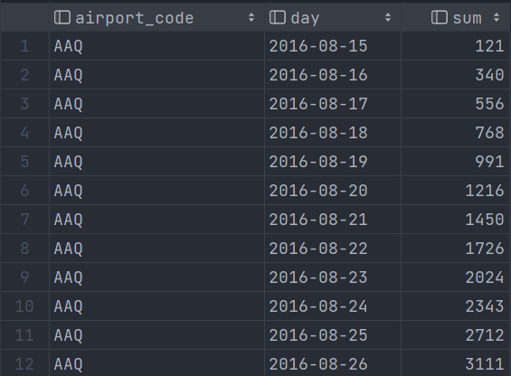


# Задание 26

**Шаги:**
1. Составить рейтинг рейсов по доходу на одно место.

**Скрипт:**

```postgresql
with aircraft_seats_count as (
    select
        a.aircraft_code,
        count(*) as seats_count
    from aircrafts a
    join seats s 
        on a.aircraft_code = s.aircraft_code
    group by a.aircraft_code
)

select 
    flight_id,
    min(price_per_seat) as price_per_seat
from (
    select 
        f.flight_id,
        sum(tf.amount) over (partition by f.flight_id) / asc1.seats_count as price_per_seat
    from flights f
    join ticket_flights tf
        on f.flight_id = tf.flight_id
    join aircraft_seats_count asc1
        on asc1.aircraft_code = f.aircraft_code
) as t 
group by flight_id
```

Результат:

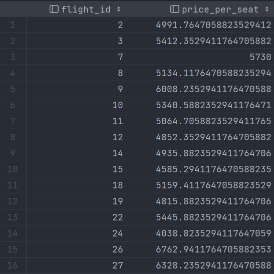


# Задание 27

**Шаги:**
1. Для каждого часа суток вывести количество вылетов и скользящее среднее за 3 предыдущих часа.

**Скрипт:**

```postgresql
select 
    hour,
    flight_out_count,
    avg(flight_out_count) over (order by hour rows between 3 preceding and current row) as avg_slide
from (
    select
        to_char(f.scheduled_departure, 'yyyy-mm-dd:HH') as hour,
        count(*) as flight_out_count
    from flights f
    group by
        to_char(f.scheduled_departure, 'yyyy-mm-dd:HH')
) as t
```

Результат:


# Задание 28

**Шаги:**
1. Для каждого рейса найти ближайший по времени рейс на том же маршруте и сравнить их заполненность.

**Скрипт:**

```postgresql
with passengers_count as (
    select
        f.flight_id,
        count(*) passengers_count
    from flights f
    join ticket_flights tf
        on f.flight_id = tf.flight_id
    group by f.flight_id
), ranked_flights as (
    select 
        f.flight_id,
        f.departure_airport,
        f.arrival_airport,
        f.actual_departure,
        pc.passengers_count,
        lead(f.flight_id) over (partition by f.arrival_airport, f.departure_airport order by f.actual_departure) as next_flight_id,
        lead(f.actual_departure) over (partition by f.arrival_airport, f.departure_airport order by f.actual_departure) as next_departure,
        lead(pc.passengers_count) over (partition by f.arrival_airport, f.departure_airport order by f.actual_departure) as next_passenger_count
    from flights f
    join passengers_count pc 
        on f.flight_id = pc.flight_id
)

select
    flight_id,
    departure_airport,
    arrival_airport,
    passengers_count as current_fill,
    next_flight_id,
    next_departure,
    next_passenger_count as next_fill,
    (next_passenger_count - passengers_count) as fill_diff,
    extract(epoch from (next_departure - actual_departure)) / 60 as time_diff_min
from ranked_flights
where next_flight_id is not null
order by departure_airport, arrival_airport, actual_departure
```

Результат:

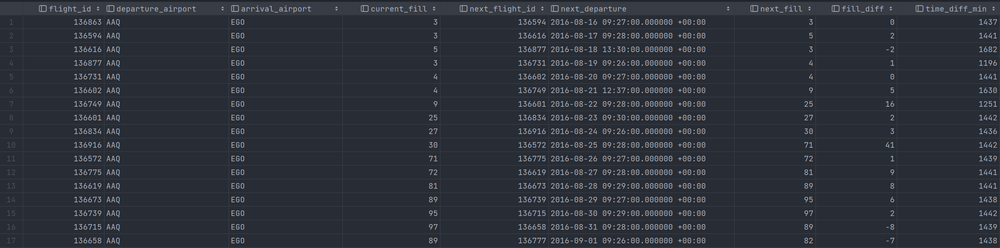


# Задание 29

**Шаги:**
1. Вывести месячный рост пассажиропотока в каждом аэропорту в абсолютных и процентных значениях.

**Скрипт:**

```postgresql
with airport_passengers_in as (
    select
        a.airport_code,
        to_char(f.actual_arrival, 'yyyy-mm') as month,
        count(*) as passengers_count_in
    from airports a
             join flights f
                  on a.airport_code = f.arrival_airport
             join ticket_flights tf
                  on f.flight_id = tf.flight_id
    group by a.airport_code, to_char(f.actual_arrival, 'yyyy-mm')
), airport_passengers_out as (
    select
        a.airport_code,
        to_char(f.actual_departure, 'yyyy-mm') as month,
        count(*) as passengers_count_out
    from airports a
             join flights f
                  on a.airport_code = f.departure_airport
             join ticket_flights tf
                  on f.flight_id = tf.flight_id
    group by a.airport_code, to_char(f.actual_departure, 'yyyy-mm')
)

select 
    api.airport_code,
    api.month,
    passengers_count_out + passengers_count_in - lag(passengers_count_out + passengers_count_in) over (partition by api.airport_code order by api.month) as absolute,
    (passengers_count_out + passengers_count_in)::numeric / lag(passengers_count_out + passengers_count_in) over (partition by api.airport_code order by api.month) as percentage
from airport_passengers_in api 
join airport_passengers_out apo 
    on api.airport_code = apo.airport_code
    and api.month = apo.month
    
```

Результат:

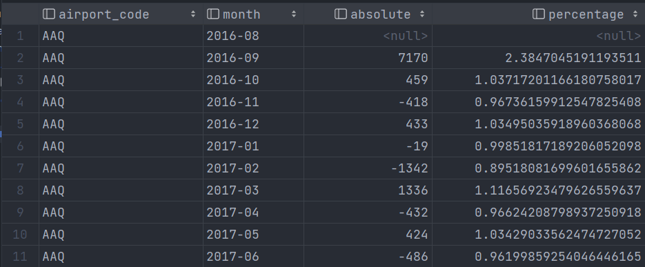


# Задание 30

**Шаги:**
1. Для каждого месяца определить, сколько пассажиров совершили перелет в следующем месяце.

**Скрипт:**

```postgresql
with t as (
    select
        t.passenger_id,
        to_char(f.actual_departure, 'yyyy-mm') as month,
        lead(f.actual_departure) over (partition by t.passenger_id order by f.actual_departure) as next_departure,
        extract(month from lead(f.actual_departure) over (partition by t.passenger_id order by f.actual_departure)) - extract(month from f.actual_departure) = 1 as condition
    from flights f
    join ticket_flights tf
         on f.flight_id = tf.flight_id
    join tickets t
         on tf.ticket_no = t.ticket_no
)

select
    month,
    count(*)
from t 
where condition = true
group by month
order by month
```

Результат:

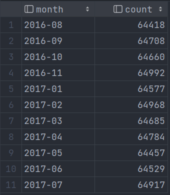


# Задание 31

**Шаги:**
1. Разбить пассажиров на 3 сегмента по частоте перелетов;
2. Проанализировать средние расходы в каждом сегменте;

**Скрипт:**

```postgresql
with month_count as (
    select count(*) as count
    from flights f
    group by to_char(f.scheduled_departure, 'yyyy-mm')
), passenger_per_flights as (
    select
        t.passenger_id,
        count(*) as flights_count,
        sum(tf.amount) as money
    from ticket_flights tf
    join tickets t 
        on tf.ticket_no = t.ticket_no
    group by t.passenger_id
), passengers_with_frequency_group as (
    select
        ppfc.passenger_id,
        ppfc.money,
        ppfc.flights_count / mc.count::numeric as frequency,
        ntile(3) over (order by ppfc.flights_count / mc.count::numeric) as frequency_group
    from passenger_per_flights ppfc
    cross join month_count mc
)

select
    pifgaepg.passenger_id,
    pifgaepg.frequency_group,
    pifgaepg.avg_expense_per_group
from (
     select
         pwfg.passenger_id,
         pwfg.frequency_group,
         avg(pwfg.money) over (partition by pwfg.frequency_group) as avg_expense_per_group
     from passengers_with_frequency_group pwfg
) as pifgaepg
group by pifgaepg.passenger_id, pifgaepg.frequency_group,
         pifgaepg.avg_expense_per_group
```

Результат:


# Задание 32

**Шаги:**
1. Для каждого маршрута вывести изменение средней стоимости билета по сравнению с предыдущей неделей.

**Скрипт:**

```postgresql
with avg_cost_ticket_per_week as (
    select
        f.departure_airport,
        f.arrival_airport,
        f.scheduled_departure,
        f.scheduled_arrival,
        extract(week from f.scheduled_departure) as week,
        extract(year from f.scheduled_departure) as year,
        avg(tf.amount) over (partition by f.departure_airport, f.arrival_airport, extract(week from f.scheduled_departure), extract(year from f.scheduled_departure)) as avg_cost
    from tickets
    join ticket_flights tf 
        on tickets.ticket_no = tf.ticket_no
    join flights 
        f on tf.flight_id = f.flight_id
), grouped_avg_cost_ticket_per_week as (
    select
        actpw.departure_airport,
        actpw.arrival_airport,
        min(actpw.scheduled_departure) as scheduled_departure,
        min(actpw.scheduled_arrival) as scheduled_arrival,
        actpw.week,
        actpw.year,
        min(actpw.avg_cost) as avg_cost
    from avg_cost_ticket_per_week actpw
    group by
        actpw.departure_airport,
        actpw.arrival_airport,
        actpw.week,
        actpw.year
)

select 
    a.year,
    a.week,
    a.departure_airport,
    a.arrival_airport,
    a.avg_cost - lag(avg_cost) over (partition by a.departure_airport, a.arrival_airport order by extract(week from a.scheduled_departure), extract(year from a.scheduled_departure)) as difference
from grouped_avg_cost_ticket_per_week a
```

Результат:

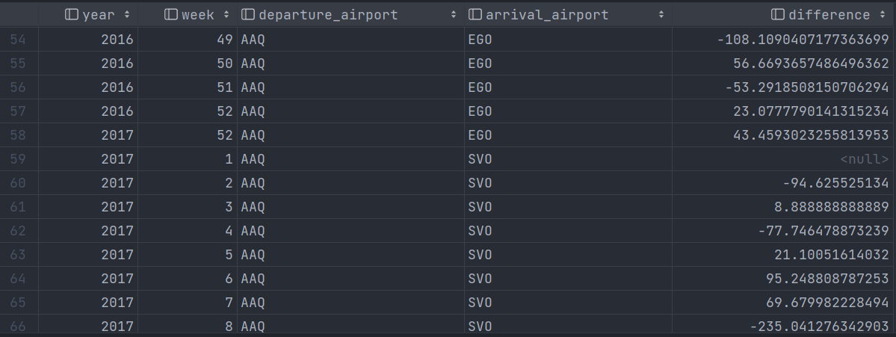


# Задание 33

**Шаги:**
1. Определить самые сезонные маршруты.

**Скрипт:**

```postgresql
with routes_per_passengers as (
    select
        f.departure_airport,
        f.arrival_airport,
        to_char(f.actual_departure, 'yyyy-mm') as month,
        count(*) as passengers_count
    from flights f
    join ticket_flights tf
        on f.flight_id = tf.flight_id
    group by f.departure_airport,
             f.arrival_airport,
             to_char(f.actual_departure, 'yyyy-mm')
), routes_per_spread as (
    select
        rpp.departure_airport,
        rpp.arrival_airport,
        max(rpp.passengers_count) over (partition by rpp.departure_airport, rpp.arrival_airport) - min(rpp.passengers_count) over (partition by rpp.departure_airport, rpp.arrival_airport) as spread
    from routes_per_passengers rpp
)

select
    t.departure_airport,
    t.arrival_airport,
    min(t.spread) spread,
    min(t.rang) rang
from (
    select rps.departure_airport,
        rps.arrival_airport,
        rps.spread,
        dense_rank() over (order by spread) as rang
    from routes_per_spread rps
) as t
group by t.departure_airport, t.arrival_airport
order by rang
```

Результат:

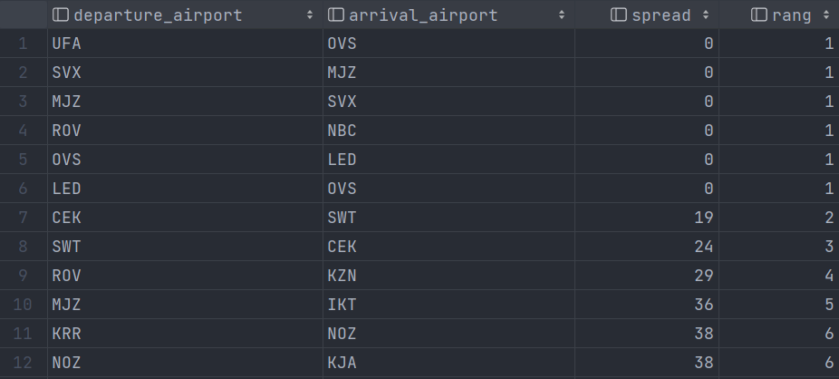


# Задание 34

**Шаги:**
1. Для каждого пассажира найти самые частые комбинации аэропортов вылета и прилета.

**Скрипт:**

```postgresql
with route_per_flights_count as (
    select
        t.passenger_id,
        f.departure_airport,
        f.arrival_airport,
        count(*) as flights_count
    from flights f
        join ticket_flights tf
             on f.flight_id = tf.flight_id
        join tickets t
             on tf.ticket_no = t.ticket_no
    group by
        t.passenger_id,
        f.departure_airport,
        f.arrival_airport
)

select
    rpfc.passenger_id,
    rpfc.departure_airport,
    rpfc.flights_count,
    rpfc.arrival_airport,
    dense_rank() over (partition by rpfc.passenger_id order by rpfc.flights_count desc) as rank
from route_per_flights_count rpfc
order by passenger_id
```

Результат:

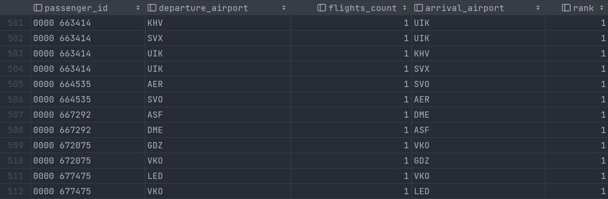


# Задание 35
(В БД нет информации об авиакомпаниях)


# Задание 36

**Шаги:**
1. Составить рейтинг самолетов по количеству перевезенных пассажиров на километр дальности.

**Скрипт:**

```postgresql
create extension if not exists cube;
create extension if not exists earthdistance;

with between_airports_distance as (
    select
        ain.airport_code as airport_in,
        aout.airport_code as airport_out,
        earth_distance(
            ll_to_earth(ain.coordinates[0], ain.coordinates[1]),
            ll_to_earth(aout.coordinates[0], aout.coordinates[1])
        ) / 1000.0 as killometers
    from airports ain 
    join airports aout
        on ain.airport_code != aout.airport_code
), aircraft_all_passengers as (
    select
        a.aircraft_code,
        count(*) as passengers_count
    from flights f
    join aircrafts a 
        on f.aircraft_code = a.aircraft_code
    join ticket_flights tf 
        on f.flight_id = tf.flight_id
    group by a.aircraft_code
)

select
    t.aircraft_code,
    dense_rank() over (order by min(t.km_per_passengers))
from (
    select
        ac.aircraft_code,
        sum(bad.killometers) over (partition by ac.aircraft_code) / aap.passengers_count::numeric as km_per_passengers
    from aircrafts ac
    join flights f
        on ac.aircraft_code = f.aircraft_code
    join between_airports_distance bad
        on f.departure_airport = bad.airport_out
        and f.arrival_airport = bad.airport_in
    join aircraft_all_passengers aap
        on aap.aircraft_code = f.aircraft_code
) as t
group by t.aircraft_code
```

Результат:

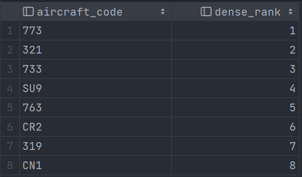


# Задание 37

**Шаги:**
1. Для каждого аэропорта вывести распределение направлений по дальности полета.

**Скрипт:**

```postgresql
create extension if not exists cube;
create extension if not exists earthdistance;

with between_airports_distance as (
    select
        ain.airport_code as airport_in,
        aout.airport_code as airport_out,
        earth_distance(
                ll_to_earth(ain.coordinates[0], ain.coordinates[1]),
                ll_to_earth(aout.coordinates[0], aout.coordinates[1])
            ) / 1000.0 as killometers
    from airports ain
    join airports aout
        on ain.airport_code != aout.airport_code
    
)

select 
    bad.airport_out,
    bad.airport_in,
    bad.killometers,
    ntile(4) over (order by bad.killometers)
from between_airports_distance bad
```

Результат:

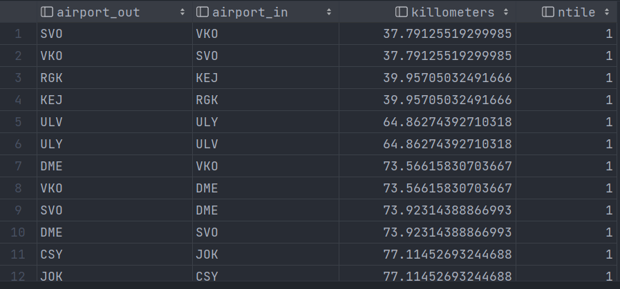


# Задание 38

**Шаги:**
1. Составить рейтинг рейсов по стабильности времени вылета (минимальное отклонение от расписания).

**Скрипт:**

```postgresql
select
    f.flight_id,
    f.scheduled_departure,
    f.actual_departure,
    dense_rank() over (order by f.actual_departure - f.scheduled_departure) as rank
from flights f
```

Результат:


# Задание 39

**Шаги:**
1. Проанализировать динамику бронирования по времени суток и дням недели.

**Скрипт:**

```postgresql
select
    case
        when b.book_date::time between '06:00' and '11:00' then 'утро'
        when b.book_date::time between '12:00' and '16:00' then 'день'
        when b.book_date::time between '17:00' and '22:00' then 'вечер'
        else 'ночь'
        end as time_group,
    count(*)
    
from bookings b
group by case
             when b.book_date::time between '06:00' and '11:00' then 'утро'
             when b.book_date::time between '12:00' and '16:00' then 'день'
             when b.book_date::time between '17:00' and '22:00' then 'вечер'
             else 'ночь'
             end;

select
    extract(dow from b.book_date) as day_of_week,
    count(*)
from bookings b
group by extract(dow from b.book_date)
```

Результат:

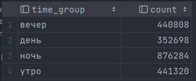

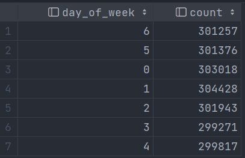


# Задание 40

**Шаги:**
1. Составить рейтинг аэропортов по скорости обработки пассажиров в час.

**Скрипт:**

```postgresql
with airport_passengers_in as (
    select
        a.airport_code,
        to_char(f.actual_arrival, 'yyyy-mm-dd:HH') as hour,
        count(*) as passengers_count_in
    from airports a
             join flights f
                  on a.airport_code = f.arrival_airport
             join ticket_flights tf
                  on f.flight_id = tf.flight_id
    group by a.airport_code, to_char(f.actual_arrival, 'yyyy-mm-dd:HH')
), airport_passengers_out as (
    select
        a.airport_code,
        to_char(f.actual_departure, 'yyyy-mm-dd:HH') as hour,
        count(*) as passengers_count_out
    from airports a
    join flights f
        on a.airport_code = f.departure_airport
    join ticket_flights tf
        on f.flight_id = tf.flight_id
    group by a.airport_code, to_char(f.actual_departure, 'yyyy-mm-dd:HH')
), airport_per_average_in_hour as (
    select
        apo.airport_code,
        avg(apo.passengers_count_out + api.passengers_count_in) over (partition by api.airport_code) as "average_in_hour"
    from airport_passengers_out apo
    join airport_passengers_in api
        on apo.airport_code = api.airport_code
        and apo.hour = api.hour 
)

select
    t.airport_code,
    min(t.average_in_hour) as average_in_hour,
    min(rank) as rank
from (
    select
        apaih.airport_code,
        apaih.average_in_hour,
        dense_rank() over (order by apaih.average_in_hour) as rank
    from airport_per_average_in_hour apaih
) t 
group by t.airport_code
order by rank
```

Результат:

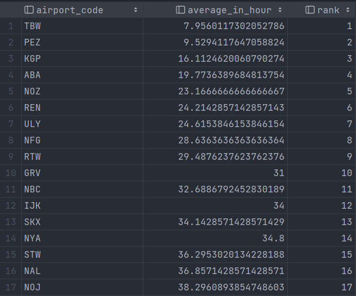


# Задание 41

**Шаги:**
1. Исследовать, как изменение цены влияет на заполняемость рейсов на различных маршрутах.

**Скрипт:**

```postgresql
with statistic as (
    select
        f.flight_id,
        f.departure_airport,
        f.arrival_airport,
        avg(tf.amount) over (partition by f.flight_id) as Средняя_цена_билета,
        count(*) over (partition by f.flight_id) as Количество_пассажиров,
        avg(amount) over (partition by f.departure_airport, f.arrival_airport) as Средняя_цена_билета_маршрута
    from flights f
    join ticket_flights tf
        on f.flight_id = tf.flight_id
)

select 
    s.flight_id,
    s.departure_airport,
    s.arrival_airport,
    Средняя_цена_билета,
    Количество_пассажиров,
    Средняя_цена_билета - lag(Средняя_цена_билета) over (partition by s.departure_airport, s.arrival_airport order by Средняя_цена_билета) as Дельта_средняя_цена_билета,
    Количество_пассажиров - lag(Количество_пассажиров) over (partition by s.departure_airport, s.arrival_airport order by Количество_пассажиров) as Дельта_количество_пассажиров
from statistic s
```

Результат:

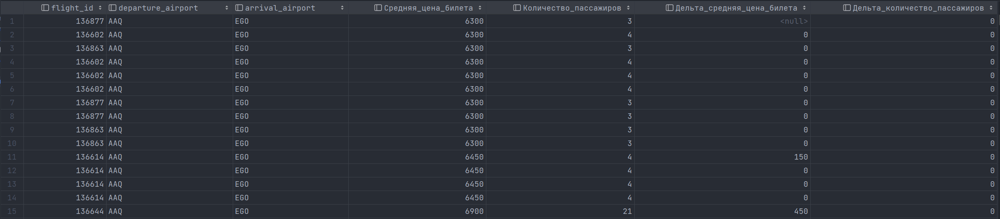