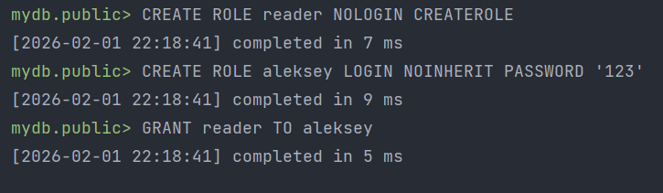
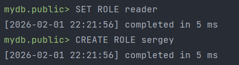

# Лабораторная работа №2

## Задание 2.15.1

**Шаги:**
1. Создать роль с возможностью подключения к БД;
2. Зайти под vova в БД;
3. Протестировать, что vova не может создавать другие роли;

**Скрипты:**
```postgresql
CREATE ROLE vova LOGIN password '123';
```
```postgresql
CREATE ROLE test;
```


## Задание 2.15.2

**Шаги:**
1. Создать пользовательскую роль;
2. Добавить пользовательскую роль в группу;
3. Зайти под пользовательской ролью;
4. Продемонстрировать возможность роли становиться групповой ролью и возможности от имени групповой роли.

**Скрипты:**
```postgresql
-- Создание групповой роли
CREATE ROLE reader NOLOGIN CREATEROLE;
-- Создание роли пользователя
CREATE ROLE aleksey LOGIN NOINHERIT PASSWORD '123';
-- Добавляем Алексея в группу reader
GRANT reader TO aleksey;
```


```postgresql
-- Алексей безуспешно создает роль
CREATE ROLE sergey;
```
Результат:


```postgresql
-- Алексей приобретает групповую роль
SET ROLE reader;
CREATE ROLE sergey;
```
Результат:



