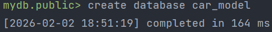
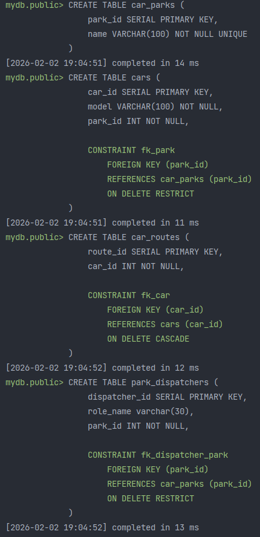
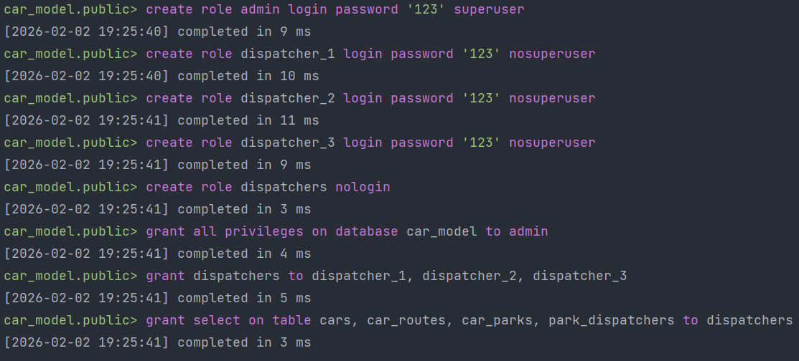
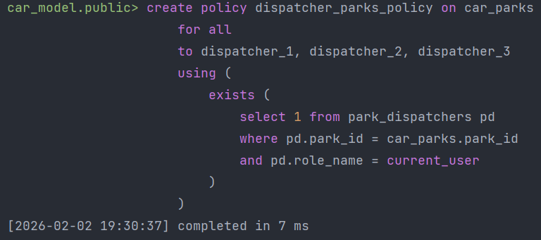
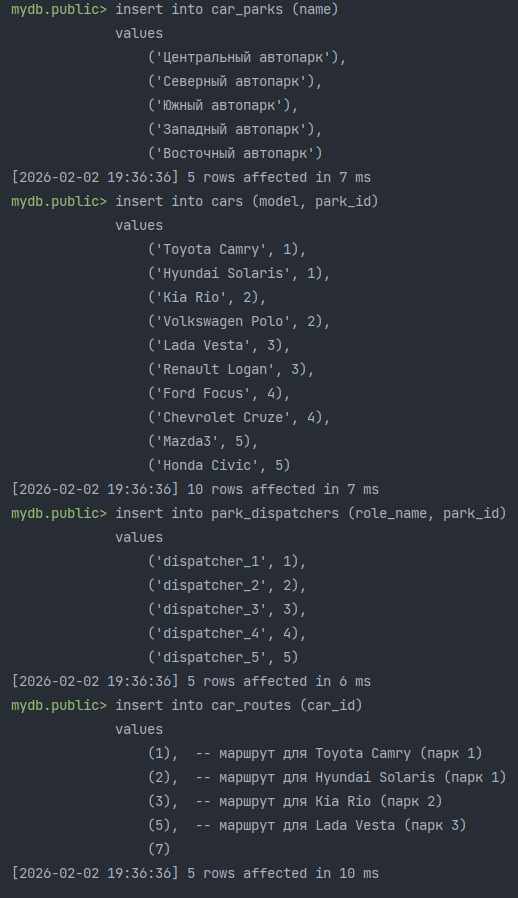
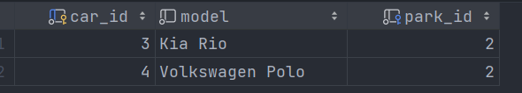
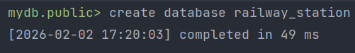
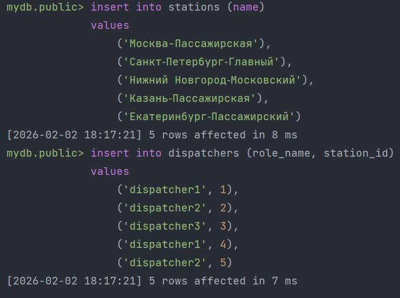
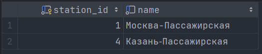

# Лабораторная работа №3

## Задание 1 (car_model)
**Шаги:**
1. Создать DATABASE для хранения автомобильной модели;
2. В созданной DATABASE создать таблицы: "Автомобили", "Маршрут автомобиля", "Парк автомобилей", "Диспетчер парка";
3. Создать роли Администратор, Диспетчер1, Диспетчер2, Диспетчер3 с возможностью подключения к БД с паролем;
4. Для диспетчеров добавить все права на таблицу "Автомобили" с возможностью просмотра сведений только по своей станции;
5. Для администратора выдать все права на все таблицы;
6. Для диспетчеров ограничить просмотр таблицы "Автомобили" (может просматривать записи о машинах из его парка автомобилей);
7. Демонстрация доступа диспетчера к таблице "Автомобили".

**Скрипты:**

```postgresql
create database car_model;
```
Результат:



<hr/>

```postgresql
-- Таблица ПАРК АВТОМОБИЛЕЙ
create table car_parks (
    park_id serial primary key ,
    name varchar(100) not null unique
);

-- Таблица АВТОМОБИЛИ
create table cars (
    car_id serial primary key,
    model varchar(100) not null,
    park_id int not null,

    constraint fk_park
        foreign key (park_id)
        references car_parks (park_id)
        on delete restrict
);

-- Таблица МАРШРУТЫ АВТОМОБИЛЕЙ
create table car_routes (
    route_id serial primary key,
    car_id int not null,

    constraint fk_car
        foreign key (car_id)
        references cars (car_id)
        on delete cascade
);

-- Таблица ДИСПЕТЧЕР ПАРКА
create table park_dispatchers (
    dispatcher_id serial primary key,
    role_name varchar(30),
    park_id int not null,

    constraint fk_dispatcher_park
        foreign key (park_id)
        references car_parks (park_id)
        on delete restrict
);
```
Результат:



<hr/>

```postgresql
-- Создаем роль администратора
create role admin login password '123' superuser;

-- Создаем роли диспетчеров
create role dispatcher_1 login password '123' nosuperuser;
create role dispatcher_2 login password '123' nosuperuser;
create role dispatcher_3 login password '123' nosuperuser;

-- Создаем групповую роль диспетчеров
create role dispatchers nologin;

-- Явно назначаем ролям доступ
grant all privileges on database car_model to admin;
grant select on table cars, car_routes, car_parks, park_dispatchers to dispatcher_1, dispatcher_2, dispatcher_3;
```
Результат:



<hr/>

```postgresql
-- Политика доступа диспетчеров к записям только из их парка автомобилей
alter table cars enable row level security;
create policy dispatcher_parks_policy on car_parks
    for all
    to dispatcher_1, dispatcher_2, dispatcher_3
    using (
        exists (
            select 1 from park_dispatchers pd
            where pd.park_id = car_parks.park_id
            and pd.role_name = current_user
        )
    );
```
Результат:



<hr/>

```postgresql
-- Заполняем таблички данными для тестов
insert into car_parks (name)
values
    ('Центральный автопарк'),
    ('Северный автопарк'),
    ('Южный автопарк'),
    ('Западный автопарк'),
    ('Восточный автопарк');

insert into cars (model, park_id)
values
    ('Toyota Camry', 1),
    ('Hyundai Solaris', 1),
    ('Kia Rio', 2),
    ('Volkswagen Polo', 2),
    ('Lada Vesta', 3),
    ('Renault Logan', 3),
    ('Ford Focus', 4),
    ('Chevrolet Cruze', 4),
    ('Mazda3', 5),
    ('Honda Civic', 5);

insert into park_dispatchers (role_name, park_id)
values
    ('dispatcher_1', 1),
    ('dispatcher_2', 2),
    ('dispatcher_3', 3),
    ('dispatcher_4', 4),
    ('dispatcher_5', 5);

insert into car_routes (car_id)
values
    (1),  -- маршрут для Toyota Camry (парк 1)
    (2),  -- маршрут для Hyundai Solaris (парк 1)
    (3),  -- маршрут для Kia Rio (парк 2)
    (5),  -- маршрут для Lada Vesta (парк 3)
    (7); -- маршрут для Ford Focus (парк 4)
```
Результат:



<hr/>

```postgresql
-- Подключаемся к БД через dispatcher_2
-- Проверяем, что для dispatcher_2 доступны записи об автомобилях: Kia Rio, Volkswagen Polo
select * from cars
```
Результат:




## Задание 2 (railway_station)
**Шаги:**
1. Создать DATABASE для хранения железнодорожной станционной модели;
2. В созданной DATABASE создать таблицы: "Станции", "Станционные диспетчера";
3. Создать роли Администратор, Диспетчер1, Диспетчер2, Диспетчер3 с возможностью подключения к БД с паролем;
4. Для диспетчеров добавить все права на таблицу "Станции" с возможностью просмотра сведений только по своей станции;
5. Для администратора выдать все права на все таблицы;
6. Продемонстрировать доступные записи для диспетчера в таблице stations.

**Скрипты:**

```postgresql
create database railway_station;
```
Результат:



<hr/>

```postgresql
-- Таблица СТАНЦИИ
create table stations (
  station_id serial primary key,
  name varchar(100) not null unique
);

-- Таблица СТАНЦИОННЫЕ ДИСПЕТЧЕРА
create table dispatchers (
    dispatcher_id serial primary key,
    role_name varchar(50) not null,
    station_id int not null,
    
    constraint fk_station
        foreign key (station_id)
        references stations (station_id)
        on delete restrict
);
```
Результат:


<hr/>

```postgresql
-- Создание роли администратора
create role admin with login password '123' superuser;

-- Создание роли диспетчеров
create role dispatcher1 with login password '123' nosuperuser nocreatedb nocreaterole;
create role dispatcher2 with login password '123' nosuperuser nocreatedb nocreaterole;
create role dispatcher3 with login password '123' nosuperuser nocreatedb nocreaterole;

-- Выдаю права на чтение таблиц диспетчерами
grant select on table stations, dispatchers to dispatcher1, dispatcher2, dispatcher3;

-- Включаю Row-Level Security для таблицы stations
alter table stations enable row level security;
```
Результат:


<hr/>

```postgresql
-- Добавляю данные в таблицы stations и dispatchers для тестов
insert into stations (name)
values
    ('Москва-Пассажирская'),
    ('Санкт‑Петербург‑Главный'),
    ('Нижний Новгород‑Московский'),
    ('Казань‑Пассажирская'),
    ('Екатеринбург‑Пассажирский');

insert into dispatchers (role_name, station_id)
values
    ('dispatcher1', 1),
    ('dispatcher2', 2),
    ('dispatcher3', 3),
    ('dispatcher1', 4),
    ('dispatcher2', 5);
```
Результат:



<hr/>

```postgresql
-- Подключаемся к БД через dispatcher1
-- Проверяем, что для dispatcher1 доступны записи о станциях: Москва-Пассажирская, Казань-Пассажирская
select * from stations;
```
Результат:

