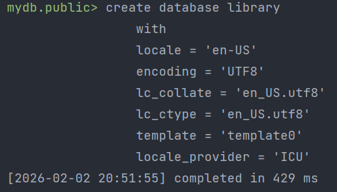
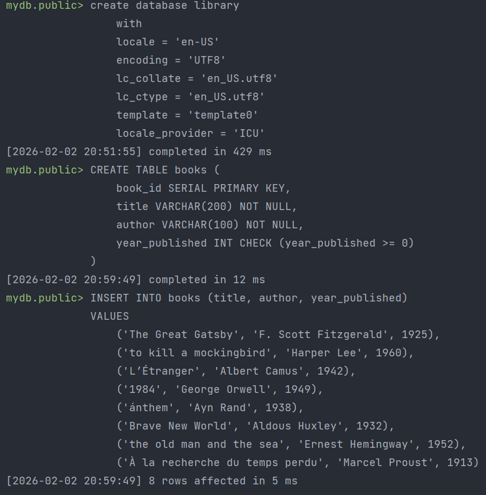
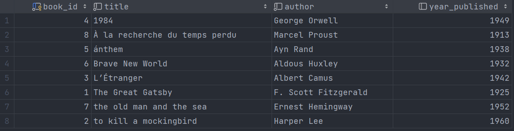
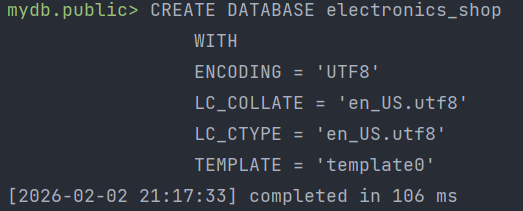
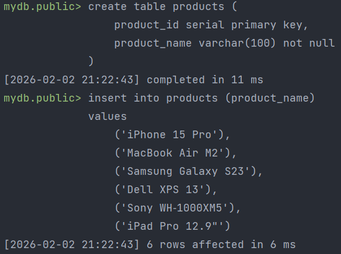
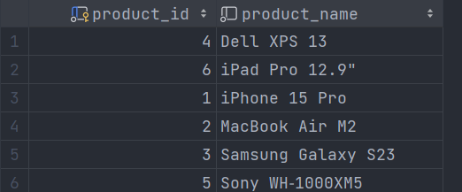
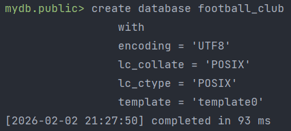
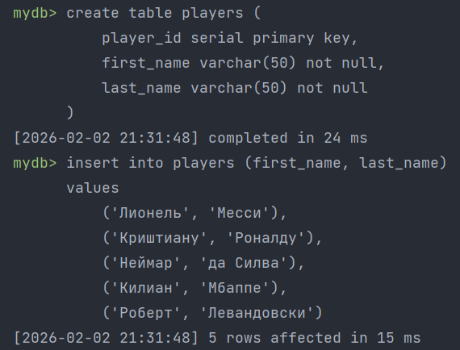

# Лабораторная работа №4

## Задание 1

**Шаги:**
1. Создать DATABASE с провайдером ICU, английской локалью и кодировкой UTF8;
2. Создать таблицу и проверить сортировку;

**Скрипты:**
```postgresql
create database library
    with 
    locale = 'en-US'
    encoding = 'UTF8'
    lc_collate = 'en_US.utf8'
    lc_ctype = 'en_US.utf8'
    template = 'template0'
    locale_provider = 'ICU'
```
Результат:



<hr/>

```postgresql
-- Заходим в database library под ivan
-- Создаем таблицу
create table books (
    book_id SERIAL PRIMARY KEY,
    title VARCHAR(200) NOT NULL,
    author VARCHAR(100) NOT NULL,
    year_published INT CHECK (year_published >= 0)
);

-- Заполняем таблицу данными
insert into books (title, author, year_published)
values 
    ('The Great Gatsby', 'F. Scott Fitzgerald', 1925),
    ('to kill a mockingbird', 'Harper Lee', 1960),
    ('L’Étranger', 'Albert Camus', 1942),
    ('1984', 'George Orwell', 1949),
    ('ánthem', 'Ayn Rand', 1938),
    ('Brave New World', 'Aldous Huxley', 1932),
    ('the old man and the sea', 'Ernest Hemingway', 1952),
    ('À la recherche du temps perdu', 'Marcel Proust', 1913);
```
Результат:



<hr/>

```postgresql
-- Проверяем сортировку
select * from books
order by title;
```
Результат:




## Задание 2

**Шаги:**
1. Создать DATABASE с провайдером LIBC, английской локалью и кодировкой UTF8;
2. Создать таблицу и проверить сортировку;

**Скрипты:**
```postgresql
create database electronics_shop
    with
    encoding = 'UTF8'
    lc_collate = 'en_US.utf8'
    lc_ctype = 'en_US.utf8'
    template = 'template0';
```
Результат:


<hr/>

```postgresql
-- Заходим в database electronics_shop под ivan
-- Создаем таблицу
create table products (
    product_id serial primary key,
    product_name varchar(100) not null
);

-- Заполняем таблицу данными
insert into products (product_name)
values 
    ('iPhone 15 Pro'),
    ('MacBook Air M2'),
    ('Samsung Galaxy S23'),
    ('Dell XPS 13'),
    ('Sony WH‑1000XM5'),
    ('iPad Pro 12.9"');
```
Результат:



<hr/>

```postgresql
-- Проверяем сортировку
select * from products
order by product_name;
```
Результат:




## Задание 3

**Шаги:**
1. Создать DATABASE с провайдером ICU, английской локалью и кодировкой UTF8;
2. Создать таблицу и проверить сортировку;

**Скрипты:**
```postgresql
create database football_club
    with
    encoding = 'UTF8'
    lc_collate = 'POSIX'
    lc_ctype = 'POSIX'
    template = 'template0';
```
Результат:



<hr/>

```postgresql
-- Заходим в database football_club под ivan
-- Создаем таблицу players
create table players (
    player_id serial primary key,
    first_name varchar(50) not null,
    last_name varchar(50) not null
);

-- Заполняем таблицу данными
insert into players (first_name, last_name)
values 
    ('Лионель', 'Месси'),
    ('Криштиану', 'Роналду'),
    ('Неймар', 'да Силва'),
    ('Килиан', 'Мбаппе'),
    ('Роберт', 'Левандовски');
```
Результат:



<hr/>

```postgresql
-- Проверяем сортировку
select * from players
order by first_name;
```
Результат:


