# Лабораторная работа №5

## Предварительные работы

**Шаги:**
1. Зайти в терминал контейнера postgresql;
2. Обновить репозиторий пакетного менеджера apt;
3. Установить утилиту mc для редактирования файла.

Установка mc:

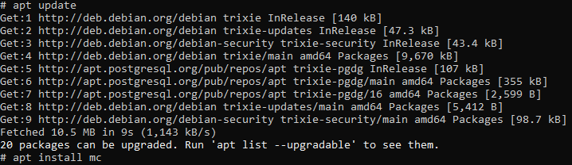

Поиск файла pg_hba.conf:

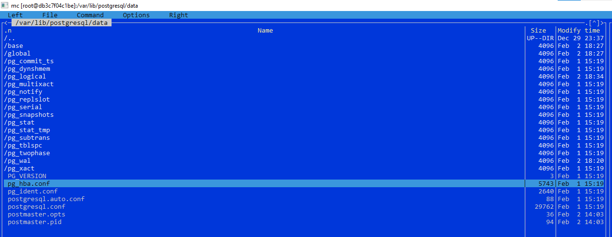


## Задание 1

**Шаги:**
1. Создать пользователя с именем 'vova';
2. Проверить, что vova может подключаться к БД;
3. В pg_hba.conf запретить vova подключаться к БД;
4. Проверить, что vova не может подключаться к БД.

**Скрипты:**
```postgresql
-- Создаем пользователя vova
create user vova login password '123'
```
Результат: 

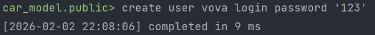

Vova может подключаться к БД:

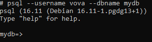

Меняем конфигурацию в файле pg_hba.conf:

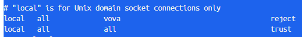

Перезагружаем конфигурацию БД:

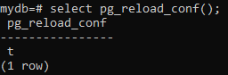

Vova не может подключаться к БД:

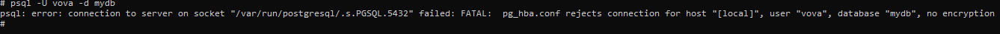


## Задание 2

**Шаги:**
1. Разрешить пользователю с именем 'petia' доступ к БД без пароля;
2. Разрешить другим пользователям подключаться с паролем;
3. Создать пользователей 'petia' и 'lev';
4. Проверить доступ к БД.

**Скрипты:**
```postgresql
-- Создаем пользователей 'petia' и 'lev';
create user petia login;
create user lev login password '123';
```
Результат:

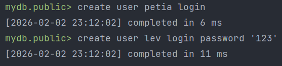

Добавляем в файл pg_hba.conf 2 записи:

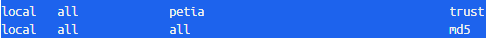

Подключаемся к БД за 'petia' (без пароля):

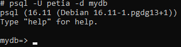

Подключаемся к БД за 'lev' (с паролем):

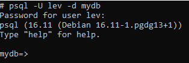


## Задание 3

**Шаги:**
1. Разрешить пользователям доступ без пароля к БД, название которых начинается на 'db';
2. Разрешить пользователям доступ с паролем к остальным БД;
3. Создать БД с именем 'dball' и пользователя с возможностью подключения и паролем;
4. Проверить доступ.

**Скрипты:**
```postgresql
-- Создание DATABASE и пользователя nikolay
create database dball;
create user nikolay login password '123';
```
Результат:

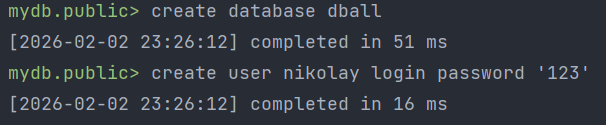

Добавим две записи в файл pg_hba.conf:


Обновление конфигураций БД:

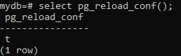

Попытка подключения к dball через пользователя nikolay (без пароля):

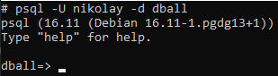

Попытка подключения к mydb через пользователя nikolay (с паролем):

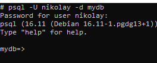


## Задание 4
**Шаги:**
1. Через представление pg_hba_file_rules посмотреть записи файла pg_hba.conf;
2. Описать для каждой записи для чего она используется.

**Скрипты:**
```postgresql
select * from pg_hba_file_rules;
```
Результат:

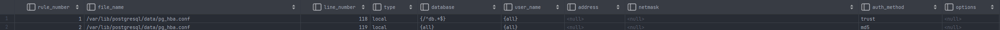

1. Разрешает всем пользователям подключаться к БД, имя которой соответствует регулярному выражению "^db.*$";
2. Разрешает всем пользователям подключаться к БД через пароль.