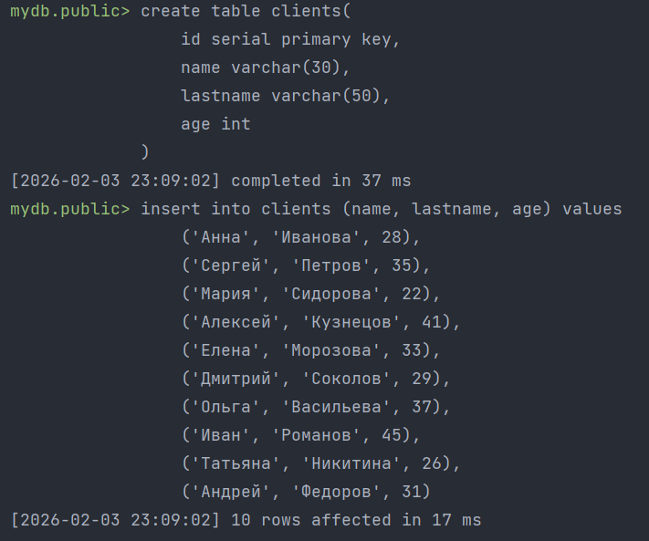
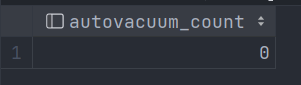
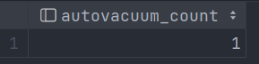

# Лабораторная работа №6

**Шаги:**
1. Создать таблицу;
2. Для созданной таблицы настроить запуск автовакума, когда количество мертвых строк достигнет 10% от текущего
размера таблицы;
3. Вставить и удалить несколько записей;
4. Продемонстировать как срабатывает автовакум.

**Скрипты:**
```postgresql
-- Создание тестовой таблицы и заполнение тестовыми данными;
create table clients(
    id serial primary key,
    name varchar(30),
    lastname varchar(50),
    age int
);
insert into clients (name, lastname, age) values
    ('Анна', 'Иванова', 28),
    ('Сергей', 'Петров', 35),
    ('Мария', 'Сидорова', 22),
    ('Алексей', 'Кузнецов', 41),
    ('Елена', 'Морозова', 33),
    ('Дмитрий', 'Соколов', 29),
    ('Ольга', 'Васильева', 37),
    ('Иван', 'Романов', 45),
    ('Татьяна', 'Никитина', 26),
    ('Андрей', 'Федоров', 31);
```
Результат:



<hr/>

```postgresql
-- Настройка параметра autovacuum_vacuum_scale_factor = 0.1 и autovacuum_vacuum_threshold=2
alter table clients set (autovacuum_vacuum_scale_factor = 0.1, autovacuum_vacuum_threshold =2);
```
Результат:


<hr/>

Проверяем, что автовакум еще ни разу не сработал:
```postgresql
select autovacuum_count from pg_stat_all_tables where relname='clients';
```
Результат:



<hr/>

Удаляем несколько записей из таблицы clients и снова проверяем, сколько раз был запущен автовакум:
```postgresql
delete from clients where id < 4;
select autovacuum_count from pg_stat_all_tables where relname='clients';
```
Результат:

