# Лабораторная работа №7

## Задание 1

**Шаги:**
1. Создать БД и несколько таблиц;
2. Создать логический бэкап в сжатом формате, используя pg_dump;
3. Удалить созданную БД и восстановить ее из бэкап.

**Скрипты:**
```postgresql
-- Создание БД и нескольких таблиц
create database bank;
create table department(
    id serial primary key,
    name varchar(50),
    address varchar(100)
);
create table employee(
    id serial primary key,
    name varchar(30),
    lastname varchar(50),
    age int,
    department_id int,
    
    constraint department_fk
        foreign key (department_id)
        references department(id)
        on delete cascade
);
```
Результат:

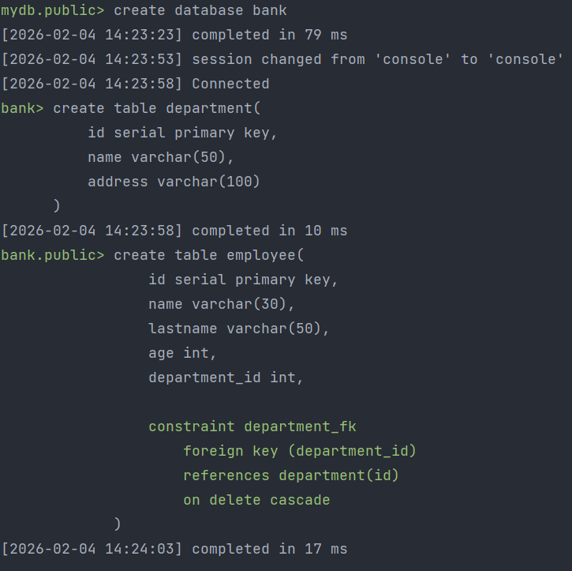

<hr/>

```postgresql
-- Заполняем таблицы данными
INSERT INTO department (name, address) VALUES
    ('IT-отдел', 'г. Москва, ул. Ленина, 10'),
    ('Отдел кадров', 'г. Москва, ул. Пушкина, 15'),
    ('Финансовый отдел', 'г. Санкт-Петербург, пр. Невский, 20'),
    ('Маркетинг', 'г. Казань, ул. Татарстан, 5');
INSERT INTO employee (name, lastname, age, department_id) VALUES
    ('Алексей', 'Иванов', 28, 1),
    ('Мария', 'Петрова', 32, 1),
    ('Дмитрий', 'Сидоров', 45, 2),
    ('Елена', 'Морозова', 29, 3),
    ('Иван', 'Кузнецов', 37, 4),
    ('Ольга', 'Васильева', 26, 1),
    ('Сергей', 'Романов', 41, 3);
```
Результат:

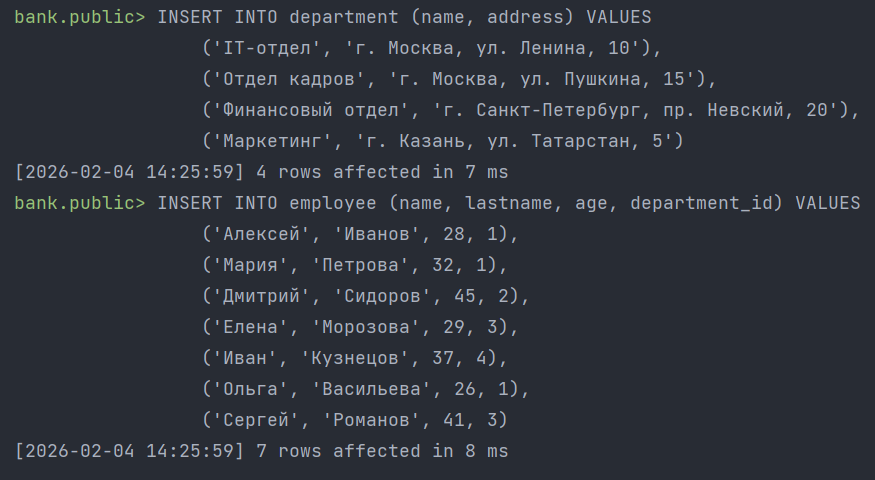

<hr/>

Создаем логический бэкап в сжатом формате:

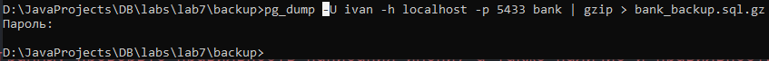

Удаляем DATABASE:
```postgresql
drop database bank;
```
Результат:

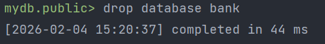

<hr/>

Восстановление БД:
```postgresql
-- Создаем DATABASE bank
create database bank;
```
Результат:

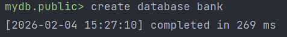

Распаковываем bank_backup.sql.gz > bank_backup.sql:

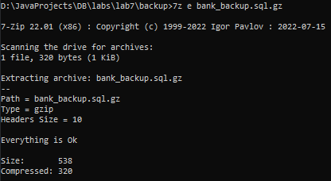

Создаем DATABASE bank:

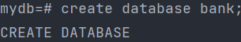

Применяем sql скрипт с бэкапом:

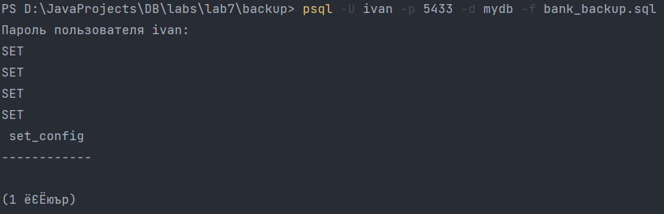

```postgresql
-- Проверка восстановления БД
select * from employee;
select * from department;
```
Результаты:

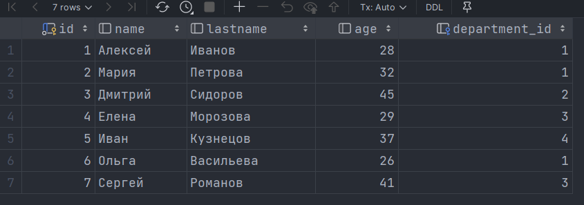

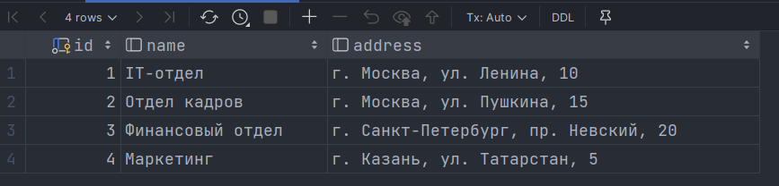


## Задание 2

**Шаги:**
1. Создать БД и несколько таблиц (будем использовать БД bank из предыдущего задания);
2. Создать логический бэкап в custom формате, используя pg_dump;
3. Удалить созданную БД и восстановить ее из бэкап;
4. Проверить восстановление.

Создаем логический бэкап в custom формате:

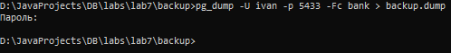

<hr/>

Удаляем DATABASE bank:
```postgresql
drop database bank;
```
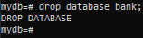

<hr/>

Восстанавливаем БД:
```postgresql
create database bank;
```
Результат:

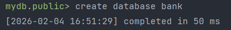

Восстанавливаем БД из бэкапа:


```postgresql
-- Проверка восстановления БД
select * from employee;
select * from department;
```
Результаты:

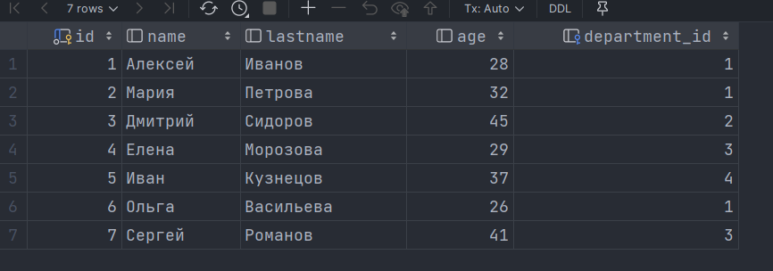

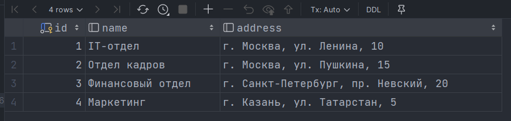


## Задание 3

**Шаги:**
1. Создать БД и несколько таблиц (будем использовать БД bank из предыдущего задания);
2. Создать логический бэкап в directory формате, используя pg_dump;
3. Удалить созданную БД и восстановить ее из бэкап;
4. Проверить восстановление.

Создаем логический бэкап в directory формате:

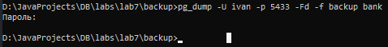

<hr/>

Удаляем DATABASE bank:
```postgresql
drop database bank;
```
Результат:


<hr/>

Восстанавливаем БД:
```postgresql
create database bank;
```
Результат:

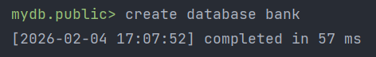

<hr/>

Восстанавливаем БД из бэкапа:

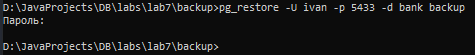

```postgresql
-- Проверка восстановления БД
select * from employee;
select * from department;
```
Результаты:

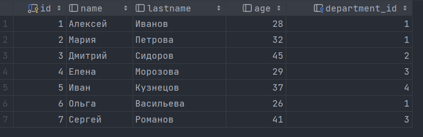

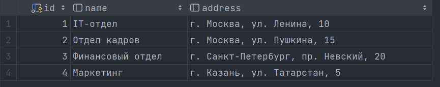


## Задание 4

**Шаги:**
1. Создать БД и несколько таблиц (будем использовать БД bank из предыдущего задания);
2. Создать физический бэкап, используя pg_basebackup;
3. Удалить созданную БД и восстановить ее из бэкап;
4. Проверить восстановление.


Создаем физический бэкап:

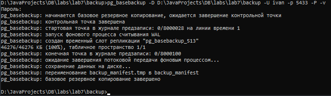

<hr/>

Удаляем DATABASE bank:
```postgresql
drop database bank;
```
Результат:

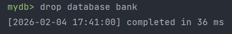

<hr/>

Перемещаем сгенерированный бэкап в Docker контейнер Postgres через том примонтированный к папке /var/lib/postgresql/data:

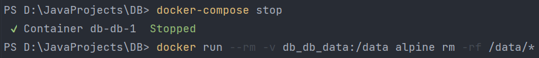

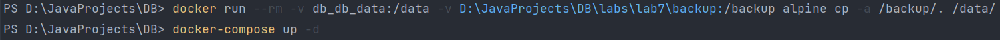

```postgresql
-- Проверка восстановления БД
select * from employee;
select * from department;
```
Результаты:

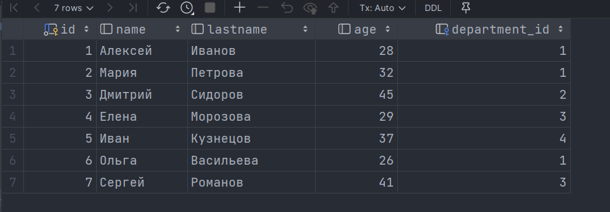

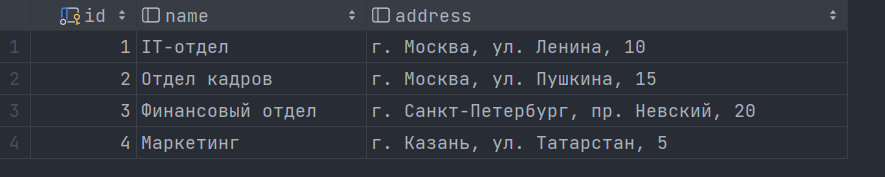