# Лабораторная работа №8

## Предварительные работы


**Создание БД и таблиц:**
```postgresql
-- Создание БД и нескольких таблиц
create database bank;
create table department(
    id serial primary key,
    name varchar(50),
    address varchar(100)
);
create table employee(
    id serial primary key,
    name varchar(30),
    lastname varchar(50),
    age int,
    department_id int,
    
    constraint department_fk
        foreign key (department_id)
        references department(id)
        on delete cascade
);
```
Результат:

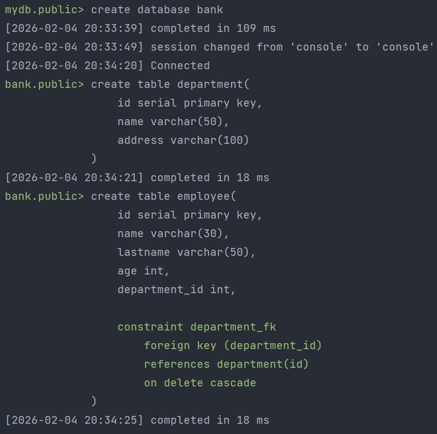

<hr/>

**Заполняем таблицы данными:**
```postgresql
insert into department (name, address) values 
    ('IT-отдел', 'г. Москва, ул. Ленина, 10'),
    ('Отдел кадров', 'г. Москва, ул. Пушкина, 15'),
    ('Финансовый отдел', 'г. Санкт-Петербург, пр. Невский, 20'),
    ('Маркетинг', 'г. Казань, ул. Татарстан, 5');
insert into employee (name, lastname, age, department_id) values 
    ('Алексей', 'Иванов', 28, 1),
    ('Мария', 'Петрова', 32, 1),
    ('Дмитрий', 'Сидоров', 45, 2),
    ('Елена', 'Морозова', 29, 3),
    ('Иван', 'Кузнецов', 37, 4),
    ('Ольга', 'Васильева', 26, 1),
    ('Сергей', 'Романов', 41, 3);
```
Результат:

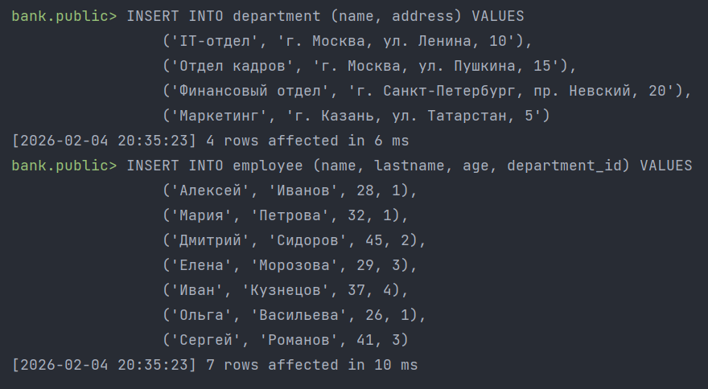

<hr/>

**Удаление нескольких строк:**
```postgresql
delete from employee where name = 'Алексей' or name = 'Дмитрий';
```
Результат:

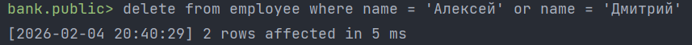

<hr/>

**Изменение нескольких строк:**
```postgresql
update employee  set lastname = 'Андрианов' where name = 'Иван';
```
Результат

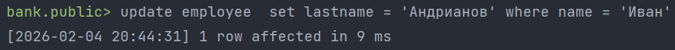


## Задание 1

**Шаги:**
1. Посмотреть, какие процессы задействованы при работе сервера; 
2. Посмотреть информацию по таблицам из pg_stat_all_tables.


**Просмотр задействованных процессов:**

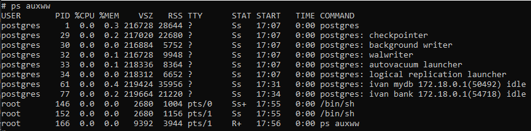

**Информация по таблицам из pg_stat_all_tables:**

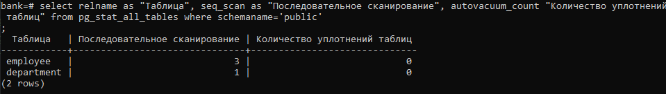


## Задание 2

**Шаги:**
1. Выполнить команду ANALYZE для таблиц;
2. Посмотреть информацию по таблицам из pg_stat_all_tables;
3. Посмотреть задействованные процессы.


**Выполнение команды ANALYZE для таблиц:**

```postgresql
analyse employee;
analyze department;
analyze department;
```
Результат:

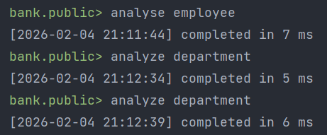

**Информация по таблицам из pg_stat_all_tables:**
```postgresql
select relname as "Таблица", analyze_count as "Количество вызовов ANALYSE", last_analyze as "Время последнего ANALYSE"
from pg_stat_all_tables
where schemaname = 'public';
```
Результат:

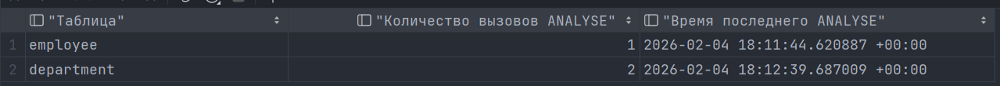

**Просмотр задействованных процессов:**

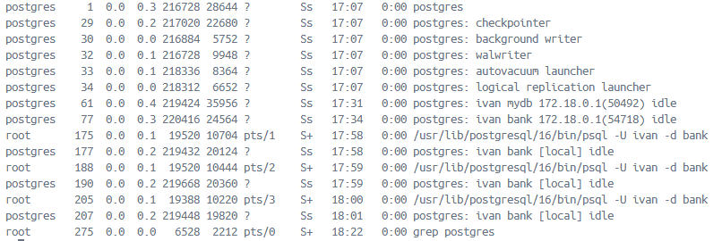

## Задание 3

**Шаги:**
1. Создать индексы для таблиц;
2. Посмотреть, какие процессы задействованы при работе сервера;
3. Посмотреть информацию по работе с индексами таблиц из pg_stat_all_tables;

**Создание индексов:**
```postgresql
create index idx_employee_lastname on employee (lastname);
create index idx_department_name on department (name);
```
Результат:

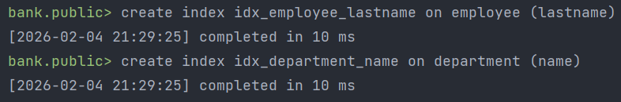

**Процессы, задействованные при работе сервера:**

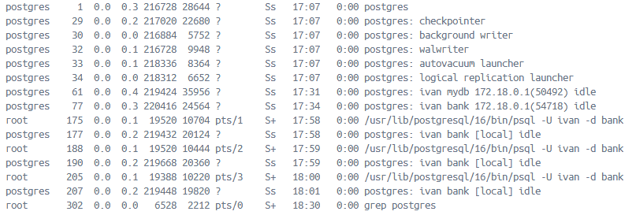

**Информация по индексам из pg_stat_all_tables:**
```postgresql
select relname as "Таблица", idx_scan as "Индексное сканирование"
from pg_stat_all_tables
where schemaname = 'public'
```
Результат:

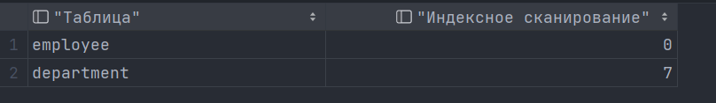