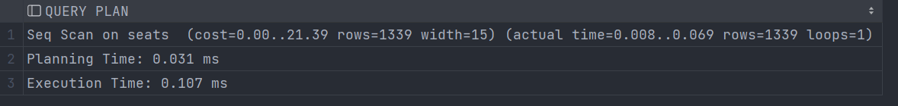
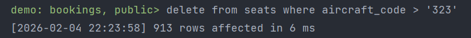
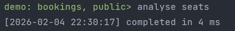
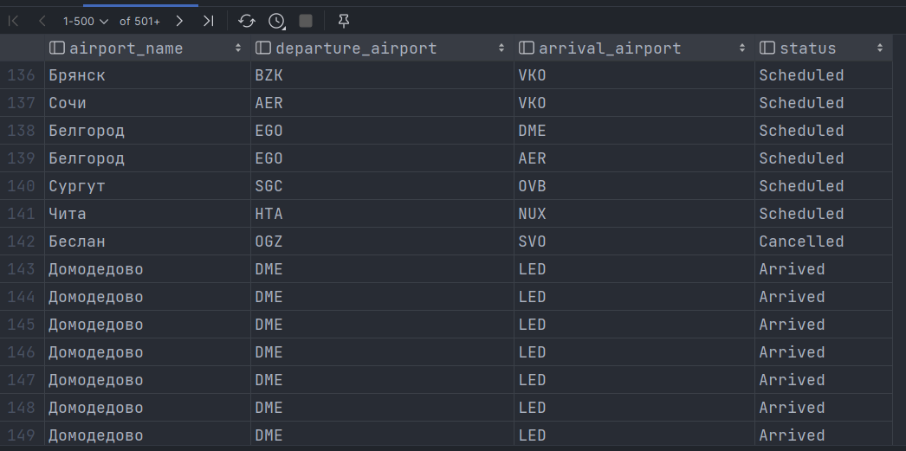
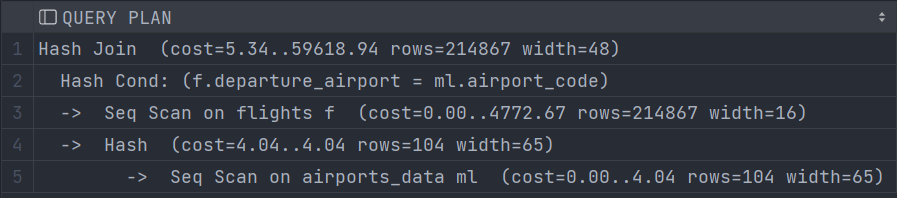
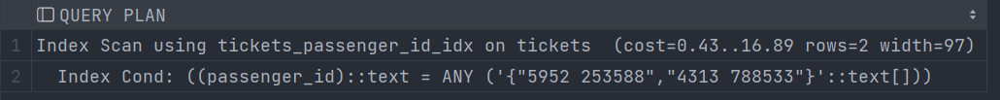
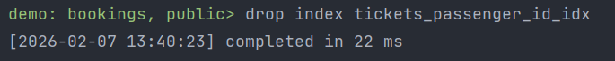
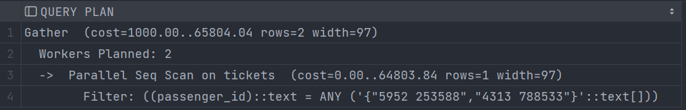

# Лабораторная работа №9

## Задание 1

**Шаги:**
1. Импортировать БД;
2. Создать запрос к таблице и исследовать план запроса;
3. Удалить из таблицы 2/3 записей;
4. Еще раз исследовать план запроса;
5. Применить к таблице команду ANALYSE;
6. Еще раз исследовать план запроса;
7. Описать и сравнить три полученных плана запроса.

**Создание запроса к таблице seats:**
```postgresql
explain select * from seats;
```
Результат:



**Удаление из таблицы seats 2/3 записей:**
```postgresql
delete from seats where aircraft_code > '323';
```
Результат:



**Исследование плана запроса:**
```postgresql
explain select * from seats;
```
Результат:


**Применить команду ANALYSE:**
```postgresql
analyse seats
```
Результат:



**Исследование плана запроса:**
```postgresql
explain select * from seats;
```
Результат:


**Описание результатов:**
1. Так как мы выполняли команду SELECT без блока WHERE, то было применено SEQ SCAN во всех трех запросах;
2. Между 2-ым и 3-им запросом нет никакой разницы;
3. До удаления 2/3 таблицы запрос имел большую стоимость (cost=0.00..21.39 rows=1339), а после удаления записей
   (cost=0.00..7.26 rows=426).

   
## Задание 2

**Шаги:**
1. Импортировать БД (Будем использовать БД из предыдущего задания);
2. Создать JOIN Запрос;
3. Описать план запроса.

**Создание JOIN запроса:**
```postgresql
select a.airport_name, f.departure_airport, f.arrival_airport, f.status
from airports a 
join flights f on a.airport_code = f.departure_airport
```
Результат:



**Описание плана запроса:**
```postgresql
explain select (
   a.airport_name,
   f.departure_airport,
   f.arrival_airport,
   f.status
)
from airports a
join flights f on a.airport_code = f.departure_airport
```
Результат:



Узлы:
1. **_Hash Join_**. Объединяет строки из flights и airports по
условию (Hash Cond: (f.departure_airport = ml.airport_code)), используя метод Hash Join (строит хеш-таблицу)
из маленькой таблицы (airport_data), затем сканирует большую (flights) и ищет совпадения в хеше;
2. **_Seg Scan on flights f_**. Последовательно читает все втроки таблицы
flights, так как нет индекса на departure_airport;
3. **_Hash_**. Строит хеш-таблицу из данных маленькой таблицы airport_data
для быстрого поиска при соединении;
4. **_Seq Scan on airports_data ml_**. Последовательно читает все строки
таблицы airports_data.

## Задание 3

**Шаги:**
1. Импортировать БД (Будем использовать БД из предыдущего задания);
2. Создать запрос к таблице с условиями отбора и по имеющимся для таблицы индексам;
3. Удалить индекс;
4. Создать еще один запрос к таблице;
5. Описать и сравнить два полученных плана.

**Запрос к таблице с условиями отбора по индексу:**
```postgresql
explain select ticket_no, passenger_id, passenger_name, contact_data
from tickets
where passenger_id in ('5952 253588', '4313 788533');
```
Результат:



**Удаление индекса:**
```postgresql
drop index tickets_passenger_id_idx;
```
Результат:



**Запрос к таблице с условием отбора:**
```postgresql
explain select ticket_no, passenger_id, passenger_name, contact_data
from tickets
where passenger_id in ('5952 253588', '4313 788533');
```
Результат:



**Сравнение двух полученных планов:**

**План с Gather + Parallel Seq Scan:**
- Запускает 2 процесса (Workers Planned: 2);
- Каждый процесс полностью сканирует таблицу tickets (Parallel Seq Scan);
- Фильтрует строки по условию passenger_id in (...);
- Координатор Gather собирает результаты от процессов.

**Проблемы:**
- Полное сканирование таблицы - Postgresql читает все строки tickets, хотя нужны всего 2;
- Нет индекса на passenger_id - оптимизатор не может использовать быстрый поиск;
- Высокие затраты из-за I/O (чтение всей таблицы) и параллелизации.

**План с Index Scan:**
- Использует индекс tickets_passenger_id_idx для прямого поиска строк;
- Находит записи по условию passenger_id in (...) через индекс;
- Читает только нужные строки из таблицы.

**Плюсы:**
- Минимальная I/O - читает только 2 строки;
- Быстрая работа - стоимость почти в 4000 раз меньше;
- Использование индекса - оптимизатор выбрал оптимальный путь.