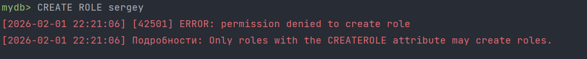

# Выполнение лабораторных работ по базам данных

### Первоначальные работы
1. Для выполнения лабораторных работ создал скрипты для первоначальной настройки базы данных в директории **/init-scripts**;
2. Для запуска базы данных использовал Docker Compose (файл с конфигурацией в корне проекта **compose.yaml**);
3. Параметры запуска базы данных поместил в файл **db-properties.env**;

### Запуск БД
Для запуска БД используйте команду:  
```bash
docker compose --env-file=db.env up
```
В терминале можно увидеть логи создания объектов DATABASE (к сожалению postgres имеет ограничение длины имени объекта
базы данных, поэтому мы видим, как он обрезает имена в консоли)

### Лабораторная работа №1
**Описание:** В рамках данной лаборатории нужно сделать следующие шаги:
1. Поднять Postgresql в Docker контейнере (что было сделано в разделе 'Запуск БД');
2. Создать указанные объекты DATABASE (что было сделано в разделе 'Запуск БД');
3. Создать указанные таблицы в каждой DATABASE;
4. В таблице 'Вокзалы' показать примеры операций _INSERT_, _SELECT_, _DELETE_, _UPDATE_.


### Лабораторная работа №2
**Задание:** 2.15.1

**Шаги:**
1. Создать роль с возможностью подключения к БД;
2. Зайти под vova в БД;
3. Протестировать, что vova не может создавать другие роли;

**Скрипты:**
```postgresql
CREATE ROLE vova LOGIN password '123';
```
```postgresql
CREATE ROLE test;
```


**Задание:** 2.15.2

**Шаги:**
1. Создать пользовательскую роль;
2. Добавить пользовательскую роль в группу;
3. Зайти под пользовательской ролью;
4. Продемонстрировать возможность роли становиться групповой ролью и возможности от имени групповой роли.

**Скрипты:**
```postgresql
-- Создание групповой роли
CREATE ROLE reader NOLOGIN CREATEROLE;
-- Создание роли пользователя
CREATE ROLE aleksey LOGIN NOINHERIT PASSWORD '123';
-- Добавляем Алексея в группу reader
GRANT reader TO aleksey;
```


```postgresql
-- Алексей безуспешно создает роль
CREATE ROLE sergey;
```
Результат:



```postgresql
-- Алексей приобретает групповую роль
SET ROLE reader;
CREATE ROLE sergey;
```
Результат:


### Лабораторная работа №3

**Шаги:**
1. Создать DATABASE для хранения железнодорожной станционной модели;
2. В созданной DATABASE создать таблицы: "Станции", "Станционные диспетчера";
3. Создать роли Администратор, Диспетчер1, Диспетчер2, Диспетчер3 с возможностью подключения к БД с паролем;

**Скрипты:**
```postgresql
create database railway_station;
```
Результат:


```postgresql
-- Таблица СТАНЦИИ
create table stations (
    station_id serial primary key,
    name varchar(100) not null unique,
    code varchar(10) unique,
    location varchar(200),
    opening_date date,
    is_active boolean default true
);

-- Таблица СТАНЦИОННЫЕ ДИСПЕТЧЕРА
create table dispatchers (
    dispatcher_id serial primary key,
    first_name varchar(50) not null,
    last_name VARCHAR(50) not null,
    station_id int not null,
    hire_date date not null,
    is_on_duty boolean default false,


    constraint fk_station
        foreign key (station_id)
            references stations (station_id)
            on delete restrict
);
```
Результат:


```postgresql
-- Создание роли администратора
create role admin with login password '123' superuser;

-- Создание роли диспетчеров
create role dispatcher1 with login password '123' nosuperuser nocreatedb nocreaterole;
create role dispatcher2 with login password '123' nosuperuser nocreatedb nocreaterole;
create role dispatcher3 with login password '123' nosuperuser nocreatedb nocreaterole;

-- Выдаю права на чтение таблиц диспетчерами
grant select on table stations to dispatcher1, dispatcher2, dispatcher3;

-- Включаю Row-Level Security для таблицы stations
alter table stations enable row level security;
```
Результат:


```postgresql

```